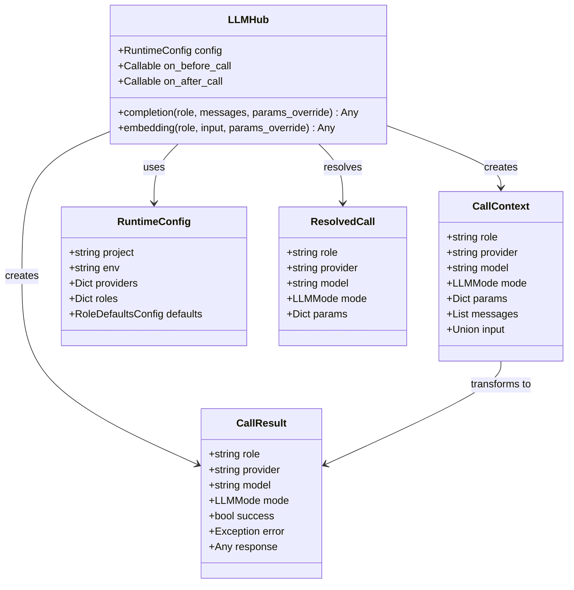
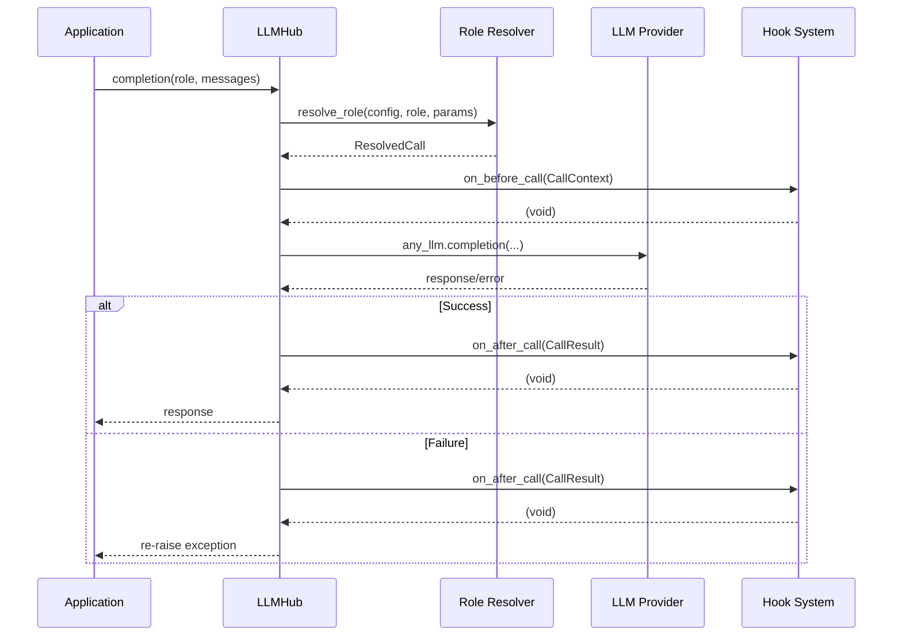

# Hooks and Observability

<cite>
**Referenced Files in This Document**
- [hub.py](file://packages/llmhub_runtime/src/llmhub_runtime/hub.py)
- [models.py](file://packages/llmhub_runtime/src/llmhub_runtime/models.py)
- [resolver.py](file://packages/llmhub_runtime/src/llmhub_runtime/resolver.py)
- [test_hub_basic.py](file://packages/llmhub_runtime/tests/test_hub_basic.py)
- [generator_hook.py](file://packages/llmhub/src/llmhub/generator_hook.py)
- [llmhub.yaml](file://packages/llmhub_runtime/tests/fixtures/llmhub.yaml)
- [PLAN.md](file://packages/llmhub_runtime/PLAN.md)
</cite>

## Table of Contents
1. [Introduction](#introduction)
2. [Hook System Architecture](#hook-system-architecture)
3. [Callback Mechanisms](#callback-mechanisms)
4. [Data Structures](#data-structures)
5. [Execution Timing](#execution-timing)
6. [Practical Hook Implementations](#practical-hook-implementations)
7. [Advanced Use Cases](#advanced-use-cases)
8. [Integration Scenarios](#integration-scenarios)
9. [Performance Considerations](#performance-considerations)
10. [Common Pitfalls](#common-pitfalls)
11. [Best Practices](#best-practices)
12. [Troubleshooting Guide](#troubleshooting-guide)

## Introduction

The LLMHub runtime provides a sophisticated observability hook system that enables developers to monitor, log, trace, and instrument LLM calls throughout their applications. The hook system consists of two primary callbacks: `on_before_call` and `on_after_call`, which provide comprehensive visibility into LLM operations while maintaining reliability through robust error handling.

This system is designed to support various observability requirements including logging, monitoring, distributed tracing, analytics, circuit breaking, rate limiting, and request/response modification. The hooks guarantee execution even during failures through careful try/finally implementation patterns.

## Hook System Architecture

The LLMHub hook system is built around a clean separation of concerns with minimal overhead. The architecture consists of several key components working together to provide comprehensive observability.



**Diagram sources**
- [hub.py](file://packages/llmhub_runtime/src/llmhub_runtime/hub.py#L13-L16)
- [models.py](file://packages/llmhub_runtime/src/llmhub_runtime/models.py#L28-L41)

**Section sources**
- [hub.py](file://packages/llmhub_runtime/src/llmhub_runtime/hub.py#L17-L50)
- [models.py](file://packages/llmhub_runtime/src/llmhub_runtime/models.py#L1-L41)

## Callback Mechanisms

### on_before_call Callback

The `on_before_call` callback executes immediately before any LLM operation, providing access to the complete call context before the actual API call is made. This callback receives a `CallContext` dictionary containing all relevant metadata about the upcoming LLM call.

Key characteristics of the `on_before_call` callback:
- **Timing**: Executed synchronously before the LLM API call
- **Purpose**: Request preprocessing, validation, logging, and instrumentation
- **Access**: Full call context including role, provider, model, parameters, and input data
- **Execution**: Guaranteed to run unless the callback itself raises an exception

### on_after_call Callback

The `on_after_call` callback executes immediately after any LLM operation completes, regardless of success or failure. This callback receives a `CallResult` dictionary containing the outcome of the LLM operation along with any error information.

Key characteristics of the `on_after_call` callback:
- **Timing**: Executed synchronously after the LLM API call completes
- **Purpose**: Response processing, metrics collection, error handling, and cleanup
- **Access**: Complete call result including success status, error information, and response data
- **Guarantee**: Executes even when the LLM call fails (through try/finally implementation)

**Section sources**
- [hub.py](file://packages/llmhub_runtime/src/llmhub_runtime/hub.py#L89-L125)
- [hub.py](file://packages/llmhub_runtime/src/llmhub_runtime/hub.py#L155-L188)

## Data Structures

### CallContext Structure

The `CallContext` data structure provides comprehensive metadata about the upcoming LLM call. It serves as the primary interface for `on_before_call` callbacks to access and modify call parameters.

| Field | Type | Description | Availability |
|-------|------|-------------|--------------|
| `role` | string | Logical role name from configuration | Always available |
| `provider` | string | Selected provider (e.g., "openai", "anthropic") | Always available |
| `model` | string | Selected model name (e.g., "gpt-4", "claude-3-5-sonnet") | Always available |
| `mode` | LLMMode | Operation mode (chat, embedding, image, audio, tool, other) | Always available |
| `params` | Dict[str, Any] | Parameter overrides and defaults | Always available |
| `messages` | List[Dict[str, Any]] | Chat messages (for completion calls) | Available for chat operations |
| `input` | Union[str, List[str]] | Input text(s) (for embedding calls) | Available for embedding operations |

### CallResult Structure

The `CallResult` data structure captures the outcome of the LLM operation, providing comprehensive information for post-processing and monitoring.

| Field | Type | Description | Availability |
|-------|------|-------------|--------------|
| `role` | string | Logical role name from configuration | Always available |
| `provider` | string | Selected provider | Always available |
| `model` | string | Selected model name | Always available |
| `mode` | LLMMode | Operation mode | Always available |
| `success` | bool | Indicates whether the call succeeded | Always available |
| `error` | Exception | Exception object if call failed | Available on failures |
| `response` | Any | Raw response from LLM provider | Available on success |

**Section sources**
- [hub.py](file://packages/llmhub_runtime/src/llmhub_runtime/hub.py#L81-L88)
- [hub.py](file://packages/llmhub_runtime/src/llmhub_runtime/hub.py#L115-L124)

## Execution Timing

The hook system follows a carefully designed execution pattern that ensures reliable operation even during failures. Understanding this timing is crucial for implementing effective observability solutions.



**Diagram sources**
- [hub.py](file://packages/llmhub_runtime/src/llmhub_runtime/hub.py#L78-L125)
- [hub.py](file://packages/llmhub_runtime/src/llmhub_runtime/hub.py#L144-L188)

### Try/Finally Implementation

The LLMHub runtime implements a robust try/finally pattern that guarantees `on_after_call` execution regardless of whether the LLM operation succeeds or fails. This design ensures that observability hooks always execute, providing complete visibility into system behavior.

Key aspects of the try/finally implementation:
- **Success Path**: `on_after_call` receives a successful result with `success: true`
- **Failure Path**: `on_after_call` receives a failed result with `success: false` and error information
- **Exception Propagation**: Original exceptions are re-raised after hook execution
- **Resource Cleanup**: Guaranteed cleanup and monitoring regardless of operation outcome

**Section sources**
- [hub.py](file://packages/llmhub_runtime/src/llmhub_runtime/hub.py#L98-L125)
- [hub.py](file://packages/llmhub_runtime/src/llmhub_runtime/hub.py#L162-L188)

## Practical Hook Implementations

### Basic Logging Hook

A fundamental logging hook that captures essential information about LLM calls for debugging and auditing purposes.

```python
def basic_logging_hook(context):
    """Basic logging hook for LLM calls."""
    logger = logging.getLogger("llmhub.hooks")
    logger.info(f"LLM Call: {context['role']} using {context['provider']}::{context['model']}")
    logger.debug(f"Parameters: {context['params']}")
    logger.debug(f"Messages: {len(context.get('messages', []))} messages")
```

### Metrics Collection Hook

A metrics collection hook that tracks call volume, latency, and success rates for operational monitoring.

```python
import time
from threading import local

_thread_local = local()

def metrics_hook(context):
    """Metrics collection hook for monitoring."""
    start_time = time.time()
    _thread_local.start_time = start_time
    
    # Track call count by role/provider
    metrics.increment("llm.calls.total", tags={
        "role": context["role"],
        "provider": context["provider"],
        "model": context["model"]
    })
```

### Distributed Tracing Hook

A distributed tracing hook that integrates with tracing systems like Jaeger or Zipkin for end-to-end request tracking.

```python
import uuid
from opentelemetry import trace

def tracing_hook(context):
    """Distributed tracing hook."""
    tracer = trace.get_tracer(__name__)
    
    # Create span with correlation ID
    span = tracer.start_span(f"llm.{context['role']}", attributes={
        "llm.role": context["role"],
        "llm.provider": context["provider"],
        "llm.model": context["model"],
        "llm.correlation_id": str(uuid.uuid4())
    })
    
    # Store span for later use
    context["_span"] = span
    return context
```

### Request Modification Hook

A hook that modifies requests before they reach the LLM provider, useful for adding authentication headers or request transformations.

```python
def request_modification_hook(context):
    """Modify requests before LLM calls."""
    # Add authentication header
    api_key = os.getenv("CUSTOM_LLM_API_KEY")
    if api_key:
        context["params"]["headers"] = {
            "Authorization": f"Bearer {api_key}",
            "X-Custom-Header": "llmhub-modified-request"
        }
    
    # Rate limiting - add delay for high-cost models
    if context["model"].startswith("gpt-4"):
        time.sleep(0.1)  # 100ms delay for premium models
    
    return context
```

**Section sources**
- [test_hub_basic.py](file://packages/llmhub_runtime/tests/test_hub_basic.py#L66-L78)

## Advanced Use Cases

### Circuit Breaker Implementation

A sophisticated circuit breaker hook that monitors LLM call failures and temporarily disables problematic providers.

```python
from collections import defaultdict
import time

class CircuitBreaker:
    def __init__(self, failure_threshold=5, recovery_timeout=30):
        self.failure_threshold = failure_threshold
        self.recovery_timeout = recovery_timeout
        self.failures = defaultdict(int)
        self.last_failure = defaultdict(float)
        self.disabled_until = defaultdict(float)
    
    def should_allow_call(self, provider):
        if time.time() < self.disabled_until[provider]:
            return False
        
        return self.failures[provider] < self.failure_threshold
    
    def record_failure(self, provider):
        self.failures[provider] += 1
        self.last_failure[provider] = time.time()
        
        if self.failures[provider] >= self.failure_threshold:
            self.disabled_until[provider] = time.time() + self.recovery_timeout
    
    def reset(self, provider):
        self.failures[provider] = 0
        self.disabled_until[provider] = 0

circuit_breaker = CircuitBreaker()

def circuit_breaker_hook(context):
    """Circuit breaker implementation."""
    provider = context["provider"]
    
    if not circuit_breaker.should_allow_call(provider):
        raise Exception(f"Provider {provider} is currently disabled")
    
    # Store original provider for result processing
    context["_original_provider"] = provider
```

### Rate Limiting Hook

A rate limiting hook that prevents LLM API abuse and ensures fair resource usage.

```python
import asyncio
from collections import deque
from datetime import datetime, timedelta

class RateLimiter:
    def __init__(self, calls_per_second=10):
        self.calls_per_second = calls_per_second
        self.call_times = defaultdict(deque)
    
    def allow_call(self, provider):
        now = datetime.now()
        call_times = self.call_times[provider]
        
        # Remove old calls (older than 1 second)
        while call_times and call_times[0] < now - timedelta(seconds=1):
            call_times.popleft()
        
        # Allow call if we haven't exceeded rate limit
        if len(call_times) < self.calls_per_second:
            call_times.append(now)
            return True
        
        return False

rate_limiter = RateLimiter()

def rate_limiting_hook(context):
    """Rate limiting implementation."""
    provider = context["provider"]
    
    if not rate_limiter.allow_call(provider):
        raise Exception(f"Rate limit exceeded for provider {provider}")
    
    # Add custom headers for rate limiting
    context["params"]["x-rate-limit-nonce"] = str(uuid.uuid4())
```

### Response Transformation Hook

A hook that modifies LLM responses for downstream processing or adds additional metadata.

```python
def response_transformation_hook(result):
    """Transform LLM responses."""
    if not result["success"] or not result["response"]:
        return result
    
    # Add metadata to response
    original_response = result["response"]
    
    # Transform response format
    transformed = {
        "content": original_response.get("choices", [{}])[0].get("message", {}).get("content", ""),
        "usage": original_response.get("usage", {}),
        "timestamp": datetime.utcnow().isoformat(),
        "correlation_id": str(uuid.uuid4()),
        "provider": result["provider"],
        "model": result["model"]
    }
    
    result["response"] = transformed
    return result
```

## Integration Scenarios

### Prometheus Metrics Integration

Integration with Prometheus for comprehensive metrics collection and alerting.

```python
from prometheus_client import Counter, Histogram, Gauge

# Define Prometheus metrics
call_counter = Counter('llm_calls_total', 'Total LLM calls', 
                      ['role', 'provider', 'model', 'success'])
call_duration = Histogram('llm_call_duration_seconds', 'LLM call duration',
                         ['role', 'provider', 'model'])
active_requests = Gauge('llm_active_requests', 'Active LLM requests')

def prometheus_metrics_hook(context):
    """Prometheus metrics integration."""
    # Increment call counter
    call_counter.labels(
        role=context["role"],
        provider=context["provider"],
        model=context["model"],
        success="false"  # Will be updated in on_after_call
    ).inc()
    
    # Track active requests
    active_requests.inc()
    
    # Store start time for duration calculation
    context["_start_time"] = time.time()
```

### Datadog APM Integration

Integration with Datadog for distributed tracing and performance monitoring.

```python
from ddtrace import tracer

def datadog_apm_hook(context):
    """Datadog APM integration."""
    with tracer.trace(f"llm.{context['role']}", service="llm-service") as span:
        span.set_tags({
            "llm.role": context["role"],
            "llm.provider": context["provider"],
            "llm.model": context["model"],
            "llm.mode": context["mode"],
            "llm.correlation_id": str(uuid.uuid4())
        })
        
        # Store span for result processing
        context["_dd_span"] = span
```

### New Relic Integration

Integration with New Relic for application performance monitoring.

```python
import newrelic.agent

def newrelic_integration_hook(context):
    """New Relic integration."""
    transaction = newrelic.agent.current_transaction()
    if transaction:
        transaction.add_custom_attribute("llm.role", context["role"])
        transaction.add_custom_attribute("llm.provider", context["provider"])
        transaction.add_custom_attribute("llm.model", context["model"])
    
    # Record custom metric
    newrelic.agent.record_custom_metric('Custom/LlmCalls', 1)
```

**Section sources**
- [PLAN.md](file://packages/llmhub_runtime/PLAN.md#L434-L439)

## Performance Considerations

### Hook Performance Impact

The hook system is designed with minimal performance overhead, but certain considerations should be kept in mind:

| Aspect | Impact | Mitigation Strategy |
|--------|--------|-------------------|
| Synchronous Execution | Blocking nature of hooks | Keep hooks lightweight and fast |
| Memory Usage | Context/result copying | Use efficient data structures |
| Network Calls | External integrations | Implement async patterns where possible |
| Serialization | Large context objects | Minimize context size |

### Optimizing Hook Performance

1. **Lightweight Operations**: Keep hooks synchronous and perform minimal work
2. **Async Patterns**: For external integrations, consider async patterns
3. **Batch Processing**: Group multiple observability operations
4. **Selective Execution**: Enable/disable hooks based on environment
5. **Memory Management**: Avoid retaining large objects in hooks

### Monitoring Hook Overhead

```python
import time
import psutil

def performance_monitoring_hook(context):
    """Monitor hook performance overhead."""
    process = psutil.Process()
    start_memory = process.memory_info().rss
    start_time = time.time()
    
    # Store metrics for result hook
    context["_perf_start_time"] = start_time
    context["_perf_start_memory"] = start_memory
```

## Common Pitfalls

### Hook Error Handling

One of the most critical aspects of hook implementation is proper error handling. Hooks should never throw exceptions that could interrupt the LLM call flow.

```python
def safe_hook(context):
    """Safe hook implementation with proper error handling."""
    try:
        # Potentially risky operations
        sensitive_operation()
    except Exception as e:
        # Log error but don't re-raise
        logger.error(f"Hook error: {e}")
        # Continue with the LLM call
        return context
```

### Memory Leaks

Avoid retaining references to large objects in hooks that could cause memory leaks.

```python
# Bad practice - retains large objects
def bad_hook(context):
    context["_large_object"] = get_large_object()  # Memory leak risk

# Good practice - minimal footprint
def good_hook(context):
    context["_simple_metadata"] = "important_info"  # Minimal memory impact
```

### Blocking Operations

Avoid blocking operations in synchronous hooks that could delay LLM calls.

```python
# Bad practice - blocking network call
def bad_hook(context):
    requests.post("https://slow-service.com/log", json=context)  # Blocks

# Good practice - fire-and-forget
def good_hook(context):
    threading.Thread(target=requests.post, args=("https://fast-service.com/log", context)).start()
```

### Context Pollution

Be careful not to modify the context in ways that could affect the LLM call.

```python
# Bad practice - modifies original context
def bad_hook(context):
    context["messages"].append({"role": "system", "content": "Modified!"})

# Good practice - creates new context
def good_hook(context):
    new_context = context.copy()
    new_context["messages"] = context["messages"].copy()
    new_context["messages"].append({"role": "system", "content": "Added!"})
    return new_context
```

## Best Practices

### Hook Design Principles

1. **Single Responsibility**: Each hook should have one clear purpose
2. **Idempotency**: Hooks should produce consistent results when called multiple times
3. **Minimal Side Effects**: Avoid unintended modifications to the context
4. **Error Resilience**: Handle all potential exceptions gracefully
5. **Performance Awareness**: Keep hooks lightweight and fast

### Configuration Management

```python
# Recommended: Environment-based configuration
ENABLE_LOGGING = os.getenv("LLMHOOK_ENABLE_LOGGING", "true").lower() == "true"
METRICS_ENDPOINT = os.getenv("LLMHOOK_METRICS_ENDPOINT", "http://localhost:8080")

def conditional_hook(context):
    """Conditionally enable hooks based on environment."""
    if not ENABLE_LOGGING:
        return context
    
    # Hook implementation
    return context
```

### Testing Hooks

```python
import unittest
from unittest.mock import MagicMock

class TestHooks(unittest.TestCase):
    def test_logging_hook(self):
        """Test logging hook behavior."""
        mock_logger = MagicMock()
        context = {
            "role": "test_role",
            "provider": "openai",
            "model": "gpt-4",
            "params": {},
            "messages": [{"role": "user", "content": "Hello"}]
        }
        
        # Test hook execution
        result = logging_hook(context)
        
        # Verify logging was called appropriately
        mock_logger.info.assert_called_once()
        self.assertEqual(result, context)
```

### Documentation Standards

```python
def documented_hook(context):
    """
    A comprehensive hook with proper documentation.
    
    Args:
        context (dict): The CallContext containing LLM call metadata
        
    Returns:
        dict: Modified context (or original if no changes needed)
        
    Raises:
        Exception: If hook encounters unrecoverable errors
        
    Example:
        >>> context = {"role": "inference", "provider": "openai"}
        >>> documented_hook(context)
        {'role': 'inference', 'provider': 'openai', '_processed': True}
    """
    # Hook implementation
    return context
```

## Troubleshooting Guide

### Common Issues and Solutions

#### Hook Not Executing

**Problem**: Hooks are not being called despite being registered.

**Solutions**:
1. Verify hook registration during LLMHub initialization
2. Check for exceptions in hook registration code
3. Ensure hooks are properly imported and accessible

```python
# Debug hook registration
def debug_hook_registration(hub):
    print(f"Before call hook: {hub.on_before_call}")
    print(f"After call hook: {hub.on_after_call}")
```

#### Performance Degradation

**Problem**: Application performance degrades after adding hooks.

**Solutions**:
1. Profile hook execution time
2. Optimize hook implementations
3. Consider async alternatives for I/O operations
4. Implement sampling for high-volume operations

```python
def performance_debug_hook(context):
    """Debug performance issues."""
    import cProfile
    profiler = cProfile.Profile()
    profiler.enable()
    
    # Hook logic here
    
    profiler.disable()
    profiler.print_stats(sort='time')
```

#### Memory Leaks

**Problem**: Memory usage increases over time with hook execution.

**Solutions**:
1. Review hook implementations for retained references
2. Use weak references where appropriate
3. Implement periodic cleanup
4. Monitor memory usage patterns

#### Context Corruption

**Problem**: LLM calls fail due to modified context.

**Solutions**:
1. Use defensive copying of context objects
2. Avoid modifying original context dictionaries
3. Implement context validation
4. Use immutable data structures where possible

```python
def safe_context_hook(context):
    """Safe context manipulation."""
    # Create defensive copy
    safe_context = context.copy()
    
    # Modify copy instead of original
    safe_context["modified"] = True
    
    return safe_context
```

### Debugging Tools

```python
def debug_hook(context):
    """Comprehensive debugging hook."""
    print(f"Hook called with context: {context}")
    print(f"Current thread: {threading.current_thread().name}")
    print(f"Memory usage: {psutil.Process().memory_info().rss / 1024 / 1024:.2f} MB")
    
    # Add breakpoint for interactive debugging
    import pdb; pdb.set_trace()
    
    return context
```

**Section sources**
- [test_hub_basic.py](file://packages/llmhub_runtime/tests/test_hub_basic.py#L65-L78)

## Conclusion

The LLMHub runtime's observability hook system provides a powerful and flexible foundation for implementing comprehensive monitoring, logging, and instrumentation solutions. Through the `on_before_call` and `on_after_call` callbacks, developers can gain deep insights into LLM operations while maintaining system reliability through robust error handling and guaranteed execution patterns.

The system's design emphasizes performance, reliability, and ease of use, making it suitable for production environments requiring sophisticated observability capabilities. Whether implementing basic logging, advanced distributed tracing, or complex circuit breaker logic, the hook system provides the necessary infrastructure with minimal overhead.

Key benefits of the LLMHub hook system include:
- **Guaranteed Execution**: Try/finally implementation ensures hooks always run
- **Rich Metadata**: Comprehensive CallContext and CallResult structures
- **Flexible Implementation**: Support for various observability patterns
- **Performance Focus**: Minimal overhead with optimized execution
- **Production Ready**: Robust error handling and reliability features

By following the guidelines, patterns, and best practices outlined in this documentation, developers can effectively leverage the LLMHub hook system to build robust, observable, and maintainable LLM-powered applications.