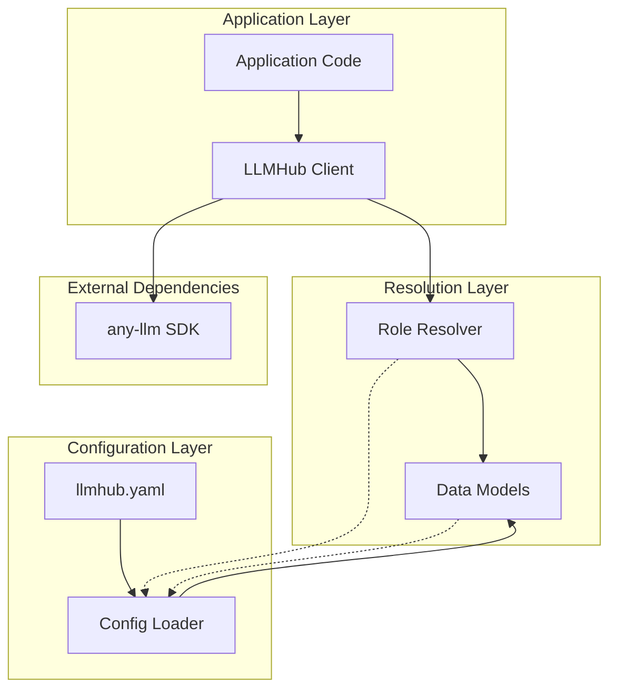
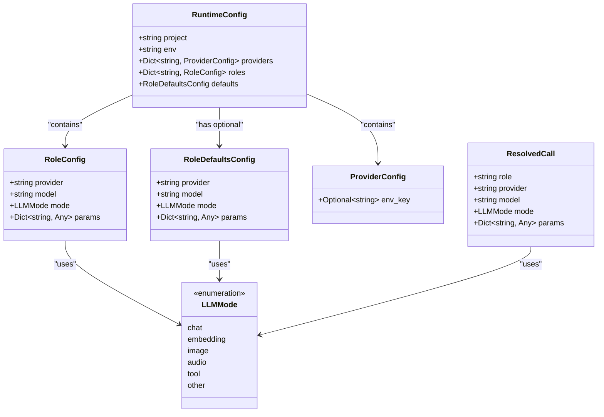
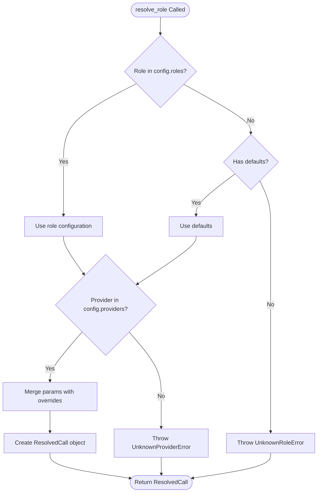
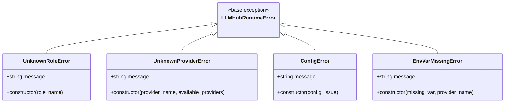
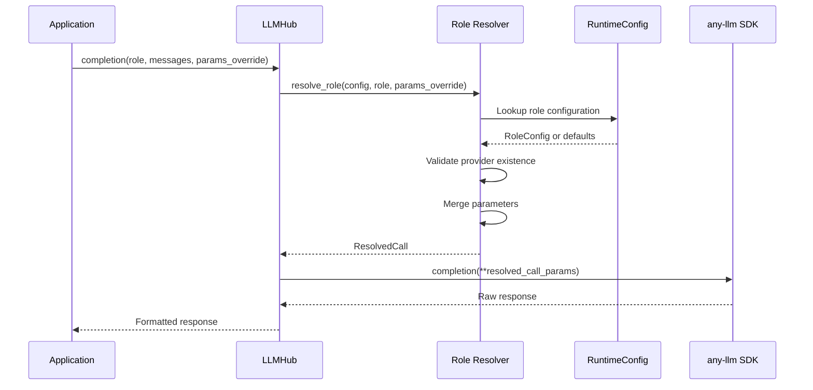

# Role Resolution System

<cite>
**Referenced Files in This Document**
- [resolver.py](file://packages/llmhub_runtime/src/llmhub_runtime/resolver.py)
- [models.py](file://packages/llmhub_runtime/src/llmhub_runtime/models.py)
- [hub.py](file://packages/llmhub_runtime/src/llmhub_runtime/hub.py)
- [config_loader.py](file://packages/llmhub_runtime/src/llmhub_runtime/config_loader.py)
- [errors.py](file://packages/llmhub_runtime/src/llmhub_runtime/errors.py)
- [test_resolver.py](file://packages/llmhub_runtime/tests/test_resolver.py)
- [llmhub.yaml](file://packages/llmhub_runtime/tests/fixtures/llmhub.yaml)
- [README.md](file://packages/llmhub_runtime/README.md)
</cite>

## Table of Contents
1. [Introduction](#introduction)
2. [System Architecture](#system-architecture)
3. [Core Components](#core-components)
4. [Role Resolution Logic](#role-resolution-logic)
5. [ResolvedCall Model](#resolvedcall-model)
6. [Parameter Merging](#parameter-merging)
7. [Error Handling](#error-handling)
8. [Integration Points](#integration-points)
9. [Usage Examples](#usage-examples)
10. [Troubleshooting Guide](#troubleshooting-guide)
11. [Best Practices](#best-practices)

## Introduction

The role resolution system is the core component of the LLM Hub runtime that maps logical role names to concrete LLM provider configurations. This system enables application code to remain provider-agnostic while maintaining flexibility in LLM selection and parameter configuration. The system operates through a three-layer architecture: configuration loading, role resolution, and execution.

The primary goal of role resolution is to decouple application logic from specific LLM providers and models, allowing developers to define roles in their application code while letting configuration management handle the concrete provider/model assignments. This approach provides several benefits:

- **Provider Agnosticism**: Application code never directly references provider or model strings
- **Flexible Configuration**: Provider/model choices can be changed through configuration updates
- **Parameter Management**: Default parameters can be defined at the role level with per-call overrides
- **Error Handling**: Comprehensive validation and meaningful error messages for configuration issues

## System Architecture

The role resolution system follows a layered architecture that separates concerns and maintains clean interfaces between components.



**Diagram sources**
- [hub.py](file://packages/llmhub_runtime/src/llmhub_runtime/hub.py#L17-L189)
- [resolver.py](file://packages/llmhub_runtime/src/llmhub_runtime/resolver.py#L5-L44)
- [config_loader.py](file://packages/llmhub_runtime/src/llmhub_runtime/config_loader.py#L6-L43)

## Core Components

### Runtime Configuration Model

The system is built around several key data models that define the configuration structure and resolved calls.



**Diagram sources**
- [models.py](file://packages/llmhub_runtime/src/llmhub_runtime/models.py#L13-L41)

**Section sources**
- [models.py](file://packages/llmhub_runtime/src/llmhub_runtime/models.py#L1-L41)

### Role Resolution Function

The `resolve_role()` function serves as the central mechanism for translating logical role names into concrete LLM configurations.



**Diagram sources**
- [resolver.py](file://packages/llmhub_runtime/src/llmhub_runtime/resolver.py#L5-L44)

**Section sources**
- [resolver.py](file://packages/llmhub_runtime/src/llmhub_runtime/resolver.py#L1-L44)

## Role Resolution Logic

The role resolution process follows a specific precedence order to determine the appropriate LLM configuration for a given role.

### Resolution Precedence

1. **Direct Role Match**: First, the system looks for an exact match of the role name in the configuration's `roles` dictionary
2. **Default Fallback**: If no direct match is found and defaults are configured, the system falls back to the default role configuration
3. **Error Condition**: If neither a direct match nor defaults are available, an `UnknownRoleError` is raised

### Provider Validation

After determining the base configuration (either from the role or defaults), the system validates that the specified provider exists in the configuration's `providers` dictionary. This ensures that the role references a valid provider that has been properly configured with environment variables.

**Section sources**
- [resolver.py](file://packages/llmhub_runtime/src/llmhub_runtime/resolver.py#L21-L33)

## ResolvedCall Model

The `ResolvedCall` model encapsulates all the information needed to execute an LLM operation after role resolution.

### Model Structure

| Field | Type | Description |
|-------|------|-------------|
| `role` | `string` | The original role name requested |
| `provider` | `string` | The LLM provider identifier |
| `model` | `string` | The specific model name |
| `mode` | `LLMMode` | The operation mode (chat, embedding, etc.) |
| `params` | `Dict[string, Any]` | Merged parameters including overrides |

### Usage in LLM Operations

The resolved call information is used to construct the appropriate API calls to the `any-llm` SDK:

```python
# Example usage in completion
response = any_llm.completion(
    provider=resolved.provider,
    model=resolved.model,
    messages=messages,
    **resolved.params
)

# Example usage in embedding
response = any_llm.embedding(
    provider=resolved.provider,
    model=resolved.model,
    inputs=input,
    **resolved.params
)
```

**Section sources**
- [models.py](file://packages/llmhub_runtime/src/llmhub_runtime/models.py#L35-L41)

## Parameter Merging

The role resolution system implements a sophisticated parameter merging mechanism that allows for flexible configuration management.

### Merge Strategy

The system uses a dictionary merge strategy where the base parameters from the role or defaults are combined with any provided overrides:

```python
params = {**base.params, **(params_override or {})}
```

This approach ensures that:
- **Base Parameters**: Default values are preserved
- **Override Priority**: Caller-provided parameters take precedence
- **Type Safety**: The merge preserves the original parameter types

### Parameter Types and Validation

Parameters can include various LLM-specific settings such as:
- **Temperature**: Controls randomness in generation (0.0 to 1.0)
- **Max Tokens**: Maximum number of tokens to generate
- **Top-p**: Nucleus sampling parameter
- **Frequency Penalty**: Reduces repetition of frequent tokens
- **Presence Penalty**: Reduces repetition of any tokens
- **Custom Parameters**: Provider-specific settings

**Section sources**
- [resolver.py](file://packages/llmhub_runtime/src/llmhub_runtime/resolver.py#L35-L36)

## Error Handling

The role resolution system provides comprehensive error handling with specific exception types for different failure scenarios.

### Error Types



**Diagram sources**
- [errors.py](file://packages/llmhub_runtime/src/llmhub_runtime/errors.py#L1-L20)

### Error Scenarios

#### UnknownRoleError
Raised when:
- The requested role doesn't exist in the configuration
- No default role configuration is available
- The configuration is empty or malformed

#### UnknownProviderError
Raised when:
- A role references a provider that doesn't exist in the providers configuration
- The provider configuration is incomplete or missing environment keys
- There's a typo in the provider name

#### ConfigError
Raised during configuration loading:
- Invalid YAML syntax
- Missing required configuration fields
- Type validation failures

#### EnvVarMissingError
Raised when:
- `strict_env` mode is enabled
- Required environment variables for providers are missing
- Environment variables are empty or invalid

**Section sources**
- [errors.py](file://packages/llmhub_runtime/src/llmhub_runtime/errors.py#L1-L20)

## Integration Points

### LLMHub Class Integration

The role resolution system integrates seamlessly with the `LLMHub` class, which serves as the main public interface for LLM operations.



**Diagram sources**
- [hub.py](file://packages/llmhub_runtime/src/llmhub_runtime/hub.py#L61-L109)
- [resolver.py](file://packages/llmhub_runtime/src/llmhub_runtime/resolver.py#L5-L44)

### Configuration Loader Integration

The resolver receives its configuration from the `RuntimeConfig` model, which is loaded and validated by the configuration loader.

**Section sources**
- [hub.py](file://packages/llmhub_runtime/src/llmhub_runtime/hub.py#L43-L46)
- [config_loader.py](file://packages/llmhub_runtime/src/llmhub_runtime/config_loader.py#L6-L43)

## Usage Examples

### Basic Role Resolution

```python
# Simple role resolution without overrides
resolved = resolve_role(config, "llm.inference")
# Result: ResolvedCall with provider=anthropic, model=claude-3-5-sonnet-20241022
```

### Role Resolution with Parameter Overrides

```python
# Role resolution with parameter overrides
resolved = resolve_role(
    config, 
    "llm.inference", 
    params_override={"temperature": 0.1, "max_tokens": 1000}
)
# Result: Uses defaults temperature (0.3) + max_tokens (1024) + override temperature (0.1)
```

### Default Role Fallback

```python
# When role doesn't exist, defaults are used
resolved = resolve_role(config, "nonexistent_role")
# Result: ResolvedCall with provider=openai, model=gpt-4o-mini, mode=chat
```

### Error Scenarios

```python
# Unknown role with no defaults
try:
    resolve_role(empty_config, "unknown_role")
except UnknownRoleError as e:
    print(f"Role not found: {e}")

# Unknown provider
try:
    resolve_role(config, "bad_provider_role")
except UnknownProviderError as e:
    print(f"Provider not found: {e}")
```

**Section sources**
- [test_resolver.py](file://packages/llmhub_runtime/tests/test_resolver.py#L37-L64)

## Troubleshooting Guide

### Common Issues and Solutions

#### Issue: "Role '{role}' not found and no defaults configured."

**Cause**: The requested role doesn't exist in the configuration, and no default role is defined.

**Solution**:
1. Verify the role name exists in the `roles` section of your `llmhub.yaml`
2. Add a default role configuration if appropriate
3. Check for typos in the role name

#### Issue: "Provider '{provider}' referenced by role '{role}' is not defined in providers."

**Cause**: The role references a provider that doesn't exist in the providers configuration.

**Solution**:
1. Add the provider to the `providers` section
2. Verify the provider name matches exactly (case-sensitive)
3. Ensure the provider has an `env_key` if required

#### Issue: "Missing environment variable: {env_key} for provider {provider}"

**Cause**: Required environment variables for providers are missing.

**Solution**:
1. Set the required environment variables
2. Verify the `env_key` values in the configuration match environment variable names
3. Check for typos in environment variable names

### Debugging Configuration

#### Validate Configuration Structure

```python
# Check configuration loading
from llmhub_runtime.config_loader import load_runtime_config
config = load_runtime_config("llmhub.yaml")

# Inspect configuration structure
print(f"Providers: {list(config.providers.keys())}")
print(f"Roles: {list(config.roles.keys())}")
print(f"Defaults: {config.defaults is not None}")
```

#### Test Role Resolution

```python
# Test role resolution with debug output
from llmhub_runtime.resolver import resolve_role
from llmhub_runtime.errors import UnknownRoleError, UnknownProviderError

try:
    resolved = resolve_role(config, "your_role_name")
    print(f"Resolved: {resolved}")
except UnknownRoleError as e:
    print(f"Role error: {e}")
except UnknownProviderError as e:
    print(f"Provider error: {e}")
```

### Configuration Validation Checklist

- [ ] Role names are defined in the `roles` section
- [ ] All referenced providers exist in the `providers` section
- [ ] Required environment variables are set
- [ ] Parameter types match expected LLM parameters
- [ ] Default role is configured if needed
- [ ] YAML syntax is valid

**Section sources**
- [test_resolver.py](file://packages/llmhub_runtime/tests/test_resolver.py#L54-L64)

## Best Practices

### Configuration Management

1. **Use Descriptive Role Names**: Choose role names that clearly indicate their purpose (e.g., `llm.preprocess`, `llm.inference`)
2. **Organize Roles Logically**: Group related roles together in your configuration
3. **Version Control Configuration**: Store `llmhub.yaml` in version control for reproducible deployments
4. **Environment-Specific Configurations**: Use different configurations for development, staging, and production

### Parameter Management

1. **Define Defaults Reasonably**: Set sensible default parameters that work across different use cases
2. **Use Parameter Overrides Sparingly**: Prefer configuration-defined parameters over per-call overrides
3. **Document Parameter Meanings**: Include comments in your configuration for complex parameter combinations
4. **Test Parameter Changes**: Thoroughly test parameter overrides before deploying to production

### Error Handling

1. **Implement Graceful Degradation**: Provide meaningful fallbacks for missing roles
2. **Log Resolution Failures**: Capture role resolution errors for monitoring and debugging
3. **Validate Configuration Early**: Check configuration validity during application startup
4. **Provide Clear Error Messages**: Use the detailed error messages to help diagnose configuration issues

### Performance Considerations

1. **Cache Resolved Calls**: Consider caching resolved calls if the same roles are used frequently
2. **Minimize Configuration Loading**: Load configuration once and reuse the RuntimeConfig object
3. **Optimize Parameter Merging**: Keep parameter dictionaries small and focused
4. **Monitor Resolution Performance**: Track role resolution times in production environments

### Security Considerations

1. **Secure Environment Variables**: Protect API keys and sensitive configuration data
2. **Validate Role Access**: Implement role-based access controls for role resolution
3. **Audit Configuration Changes**: Monitor changes to LLM configuration and role assignments
4. **Limit Provider Access**: Restrict which providers can be used in different environments

The role resolution system provides a robust foundation for managing LLM configurations while maintaining flexibility and reliability. By following these best practices and understanding the system's capabilities, developers can build maintainable and scalable LLM-powered applications.