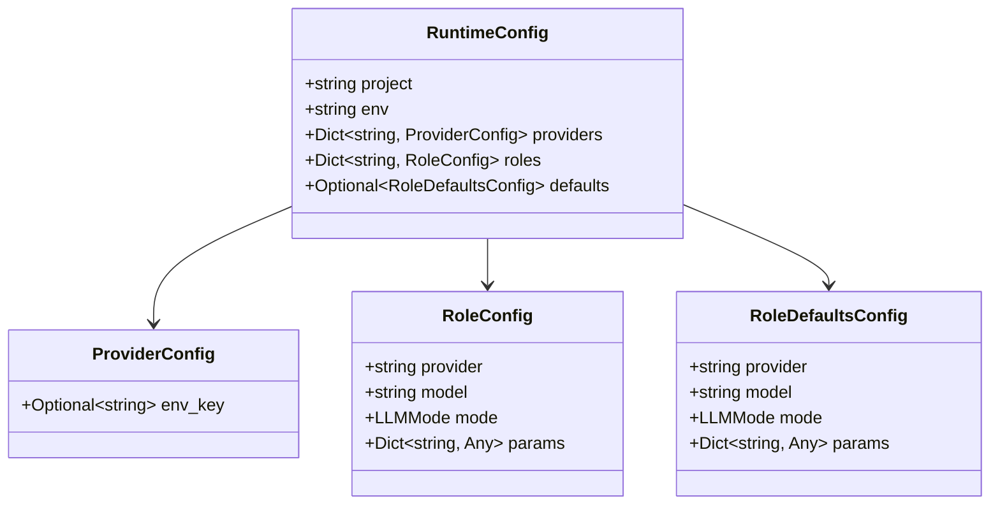
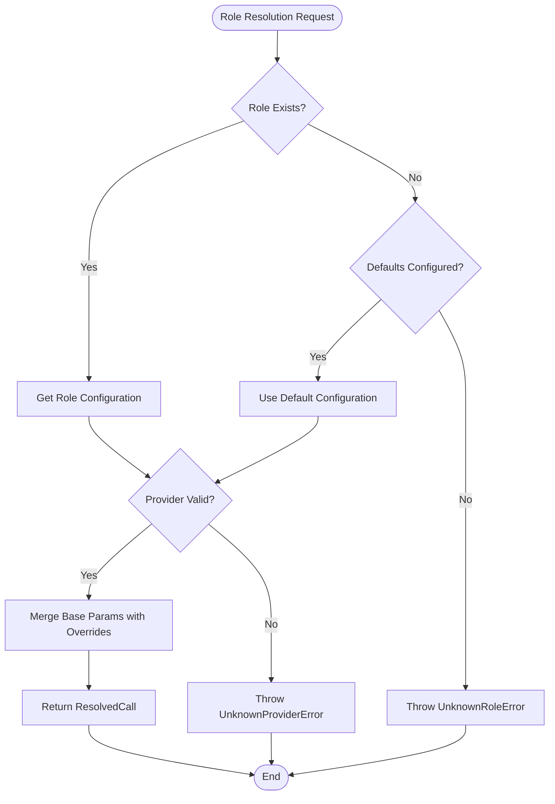
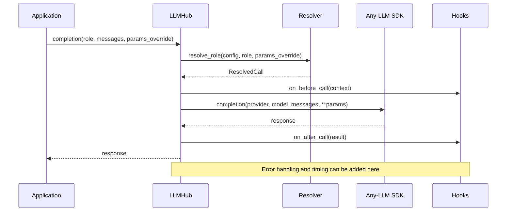
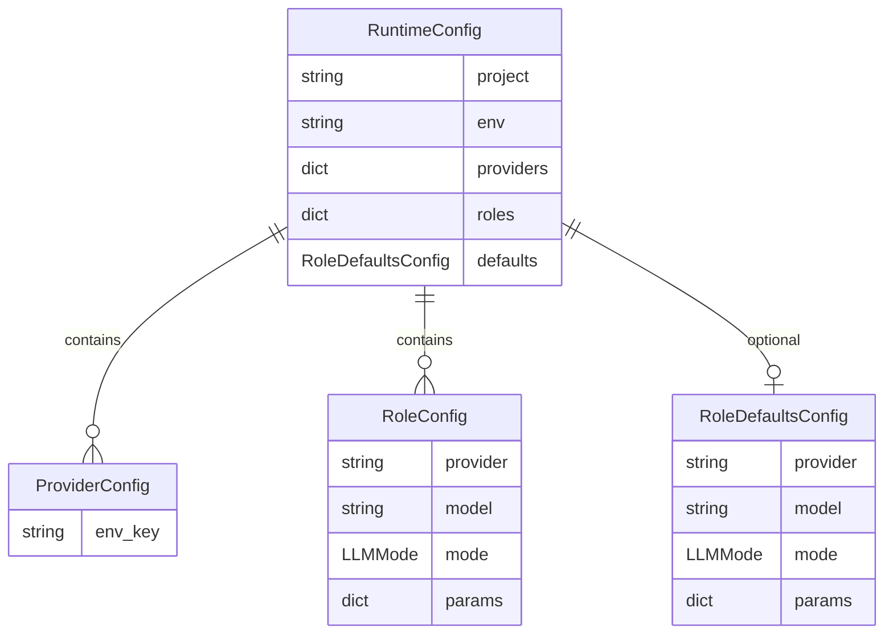
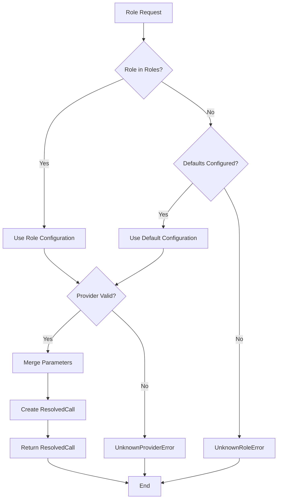
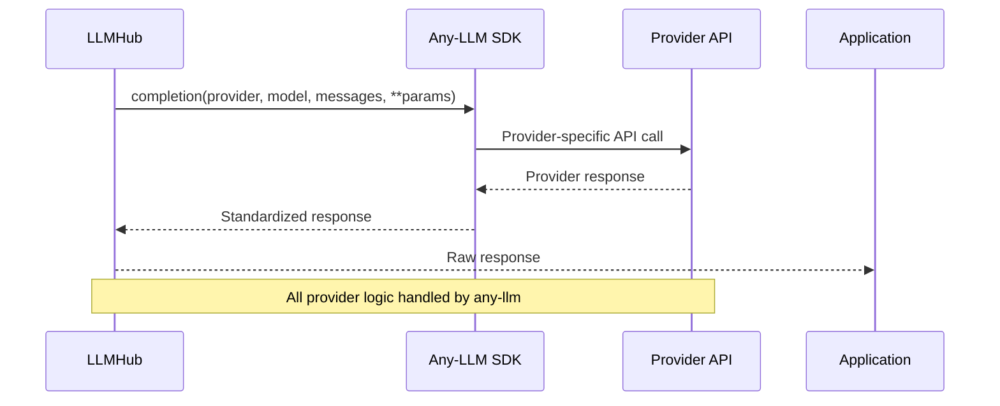
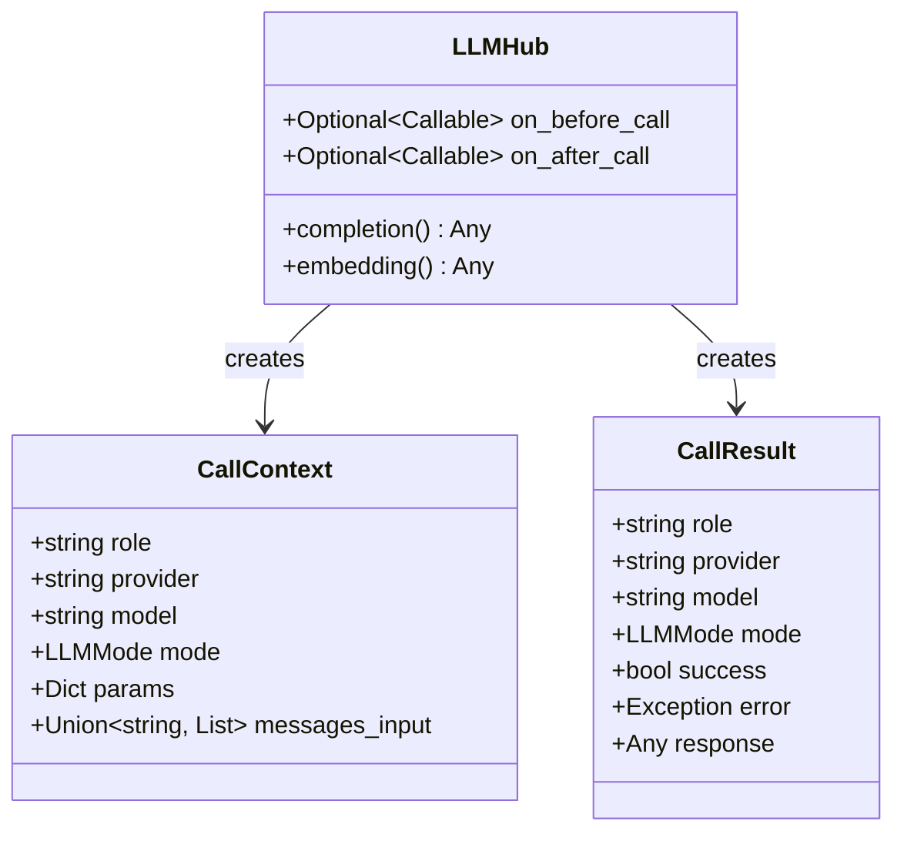

# Runtime Library Architecture Documentation

<cite>
**Referenced Files in This Document**
- [hub.py](file://packages/runtime/src/llmhub_runtime/hub.py) - *Updated in recent commit*
- [config_loader.py](file://packages/runtime/src/llmhub_runtime/config_loader.py) - *Updated in recent commit*
- [resolver.py](file://packages/runtime/src/llmhub_runtime/resolver.py) - *Updated in recent commit*
- [models.py](file://packages/runtime/src/llmhub_runtime/models.py) - *Updated in recent commit*
- [errors.py](file://packages/runtime/src/llmhub_runtime/errors.py) - *Updated in recent commit*
- [test_hub_basic.py](file://packages/runtime/tests/test_hub_basic.py) - *Updated in recent commit*
- [test_config_loader.py](file://packages/runtime/tests/test_config_loader.py) - *Updated in recent commit*
- [test_resolver.py](file://packages/runtime/tests/test_resolver.py) - *Updated in recent commit*
- [llmhub.yaml](file://packages/runtime/tests/fixtures/llmhub.yaml) - *Updated in recent commit*
- [README.md](file://packages/runtime/README.md) - *Updated in recent commit*
- [pyproject.toml](file://packages/runtime/pyproject.toml) - *Updated in recent commit*
- [CHANGELOG.md](file://packages/runtime/CHANGELOG.md) - *Added in recent commit*
- [MIGRATION_SUMMARY.md](file://MIGRATION_SUMMARY.md) - *Added in recent commit*
</cite>

## Update Summary
**Changes Made**
- Updated all file paths to reflect new package location in `packages/runtime/`
- Updated PyPI package name from `llmhub-runtime` to `rethink-llmhub-runtime`
- Updated repository structure references to reflect separation of runtime and CLI packages
- Added migration guide information for package installation changes
- Updated source references to point to new file locations

**New Sections Added**
- None

**Deprecated/Removed Sections**
- None

**Source Tracking System Updates and New Source Files**
- Updated all file references to point to new location in `packages/runtime/`
- Added CHANGELOG.md and MIGRATION_SUMMARY.md to referenced files
- Updated pyproject.toml references to show new package name
- Maintained same import namespace `llmhub_runtime` despite package relocation

## Table of Contents
1. [Introduction](#introduction)
2. [Architecture Overview](#architecture-overview)
3. [Three-Layer Architecture](#three-layer-architecture)
4. [Public API Documentation](#public-api-documentation)
5. [Configuration System](#configuration-system)
6. [Role Resolution Engine](#role-resolution-engine)
7. [Execution Layer](#execution-layer)
8. [Hook System and Observability](#hook-system-and-observability)
9. [Error Handling and Validation](#error-handling-and-validation)
10. [Design Principles](#design-principles)
11. [Performance and Reliability](#performance-and-reliability)
12. [Production Considerations](#production-considerations)
13. [Usage Patterns](#usage-patterns)
14. [Conclusion](#conclusion)

## Introduction

The `llmhub_runtime` library is a lightweight Python package designed for executing Large Language Model (LLM) calls based on role-based configuration. It serves as a runtime component that delegates all provider-specific logic to the `any-llm` SDK while providing a clean abstraction layer for application developers.

The library follows a three-layer architecture pattern that separates concerns between configuration loading, role resolution, and execution, enabling provider-agnostic LLM calls through a simple role-based interface. This documentation has been updated to reflect the new runtime library architecture with the package separated into its own `packages/runtime` directory.

## Architecture Overview

The llmhub_runtime library implements a minimalist yet robust architecture centered around three core components:

```mermaid
graph TB
subgraph "Application Layer"
App[Application Code]
end
subgraph "Runtime Layer"
LLMHub[LLMHub Class]
HubMethods[completion(), embedding()]
end
subgraph "Resolution Layer"
Resolver[Resolver Module]
RoleMapping[Role → Provider/Model Mapping]
end
subgraph "Configuration Layer"
ConfigLoader[Config Loader]
RuntimeConfig[RuntimeConfig Model]
YamlFile[llmhub.yaml]
end
subgraph "Execution Layer"
AnyLLM[Any-LLM SDK]
Providers[OpenAI, Anthropic, etc.]
end
App --> LLMHub
LLMHub --> HubMethods
LLMHub --> Resolver
LlmHub --> ConfigLoader
Resolver --> RuntimeConfig
ConfigLoader --> YamlFile
HubMethods --> AnyLLM
AnyLLM --> Providers
```

**Diagram sources**
- [hub.py](file://packages/runtime/src/llmhub_runtime/hub.py#L17-L189)
- [resolver.py](file://packages/runtime/src/llmhub_runtime/resolver.py#L5-L44)
- [config_loader.py](file://packages/runtime/src/llmhub_runtime/config_loader.py#L6-L43)

## Three-Layer Architecture

### Layer 1: Configuration Loading (config_loader.py)

The configuration layer is responsible for loading and validating the runtime configuration from YAML files.



**Diagram sources**
- [models.py](file://packages/runtime/src/llmhub_runtime/models.py#L28-L41)

The configuration loading process involves:
- YAML parsing using PyYAML
- Pydantic model validation for type safety
- Error handling for malformed configurations
- Environment variable validation when enabled

**Section sources**
- [config_loader.py](file://packages/runtime/src/llmhub_runtime/config_loader.py#L6-L43)
- [models.py](file://packages/runtime/src/llmhub_runtime/models.py#L28-L41)

### Layer 2: Role Resolution (resolver.py)

The resolution layer maps logical role names to concrete provider, model, and parameter combinations.



**Diagram sources**
- [resolver.py](file://packages/runtime/src/llmhub_runtime/resolver.py#L5-L44)

Key features of the resolution engine:
- Role-to-provider mapping with fallback to defaults
- Parameter merging with override support
- Provider validation against configured providers
- Type-safe parameter handling

**Section sources**
- [resolver.py](file://packages/runtime/src/llmhub_runtime/resolver.py#L5-L44)

### Layer 3: Execution (hub.py)

The execution layer provides the main public API and orchestrates the entire LLM call process.



**Diagram sources**
- [hub.py](file://packages/runtime/src/llmhub_runtime/hub.py#L61-L126)

**Section sources**
- [hub.py](file://packages/runtime/src/llmhub_runtime/hub.py#L17-L189)

## Public API Documentation

### LLMHub Class

The primary interface for interacting with the runtime library.

#### Initialization Parameters

| Parameter | Type | Description | Default |
|-----------|------|-------------|---------|
| `config_path` | `Optional[str]` | Path to llmhub.yaml configuration file | `None` |
| `config_obj` | `Optional[RuntimeConfig]` | Pre-loaded RuntimeConfig object | `None` |
| `strict_env` | `bool` | Enable environment variable validation | `False` |
| `on_before_call` | `Optional[Callable]` | Hook executed before LLM calls | `None` |
| `on_after_call` | `Optional[Callable]` | Hook executed after LLM calls | `None` |

#### Core Methods

##### completion(role: str, messages: List[Dict[str, Any]], params_override: Optional[Dict[str, Any]] = None) -> Any

Performs chat completion for the specified role.

**Parameters:**
- `role`: Logical role name from configuration
- `messages`: List of chat messages in OpenAI format
- `params_override`: Optional parameter overrides

**Returns:** Raw response from any-llm SDK

##### embedding(role: str, input: Union[str, List[str]], params_override: Optional[Dict[str, Any]] = None) -> Any

Generates embeddings for the specified input using the configured role.

**Parameters:**
- `role`: Logical role name from configuration
- `input`: Text or list of texts to embed
- `params_override`: Optional parameter overrides

**Returns:** Raw embedding response from any-llm SDK

**Section sources**
- [hub.py](file://packages/runtime/src/llmhub_runtime/hub.py#L18-L189)

## Configuration System

### Runtime Configuration Structure

The configuration system uses Pydantic models for type safety and validation:



**Diagram sources**
- [models.py](file://packages/runtime/src/llmhub_runtime/models.py#L28-L41)

### Configuration Loading Process

The configuration loading follows a two-stage process:

1. **File Loading**: YAML parsing with error handling
2. **Validation**: Pydantic model validation with detailed error reporting

**Section sources**
- [config_loader.py](file://packages/runtime/src/llmhub_runtime/config_loader.py#L6-L43)
- [models.py](file://packages/runtime/src/llmhub_runtime/models.py#L28-L41)

## Role Resolution Engine

### Resolution Algorithm

The role resolution engine implements a fallback mechanism:



**Diagram sources**
- [resolver.py](file://packages/runtime/src/llmhub_runtime/resolver.py#L5-L44)

### Parameter Override Mechanism

The resolution engine supports parameter overrides through a merge strategy:
- Base parameters from role configuration
- Override parameters from caller
- Final merged parameters passed to any-llm

**Section sources**
- [resolver.py](file://packages/runtime/src/llmhub_runtime/resolver.py#L5-L44)

## Execution Layer

### Provider Delegation

The execution layer delegates all provider-specific logic to the any-llm SDK:



**Diagram sources**
- [hub.py](file://packages/runtime/src/llmhub_runtime/hub.py#L98-L108)

### Error Propagation

The execution layer propagates errors from any-llm while maintaining the library's error hierarchy:

- Provider-specific errors become any-llm exceptions
- Library-specific errors remain as LLMHubRuntimeError subclasses
- All errors are re-raised with original traceback preserved

**Section sources**
- [hub.py](file://packages/runtime/src/llmhub_runtime/hub.py#L98-L112)

## Hook System and Observability

### Hook Architecture

The library provides a hook system for observability and monitoring:



**Diagram sources**
- [hub.py](file://packages/runtime/src/llmhub_runtime/hub.py#L14-L16)
- [hub.py](file://packages/runtime/src/llmhub_runtime/hub.py#L61-L126)

### Hook Implementation Pattern

Both `completion()` and `embedding()` methods support the same hook pattern:

1. **Before Call Hook**: Executed with call context containing all parameters
2. **After Call Hook**: Executed with call result containing success/failure status

**Section sources**
- [hub.py](file://packages/runtime/src/llmhub_runtime/hub.py#L80-L126)

## Error Handling and Validation

### Error Hierarchy

The library implements a comprehensive error handling system:

```mermaid
classDiagram
class LLMHubRuntimeError {
<<Exception>>
}
class ConfigError {
<<LLMHubRuntimeError>>
"For invalid or unreadable configs"
}
class UnknownRoleError {
<<LLMHubRuntimeError>>
"When an unknown role is requested"
}
class UnknownProviderError {
<<LLMHubRuntimeError>>
"When a role references undefined provider"
}
class EnvVarMissingError {
<<LLMHubRuntimeError>>
"If runtime validates env_key and var is missing"
}
LLMHubRuntimeError <|-- ConfigError
LLMHubRuntimeError <|-- UnknownRoleError
LLMHubRuntimeError <|-- UnknownProviderError
LLMHubRuntimeError <|-- EnvVarMissingError
```

**Diagram sources**
- [errors.py](file://packages/runtime/src/llmhub_runtime/errors.py#L1-L20)

### Environment Validation

The library supports strict environment validation:

- **Lazy Validation**: Disabled by default for flexibility
- **Strict Validation**: Enabled via `strict_env=True` parameter
- **Early Detection**: Environment errors detected during initialization
- **Clear Error Messages**: Specific feedback about missing environment variables

**Section sources**
- [errors.py](file://packages/runtime/src/llmhub_runtime/errors.py#L1-L20)
- [hub.py](file://packages/runtime/src/llmhub_runtime/hub.py#L52-L60)

## Design Principles

### Provider-Agnosticism

The library maintains strict separation between:
- **Configuration**: Provider/model selection stored in YAML
- **Execution**: Delegation to any-llm SDK
- **Application Logic**: Role-based interface without provider awareness

### Minimal Dependencies

The library maintains a minimal dependency footprint:
- **any-llm-sdk**: Core provider delegation (optional import)
- **PyYAML**: Configuration file parsing
- **Pydantic**: Type validation and serialization
- **Standard Library**: Core functionality without external dependencies

### Separation from Discovery Logic

The runtime deliberately excludes:
- **Model Discovery**: No automatic model listing or capability detection
- **Scoring**: No performance evaluation or ranking
- **Fallback Logic**: No automatic failover between providers
- **Caching**: No built-in caching mechanisms

**Section sources**
- [README.md](file://packages/runtime/README.md#L7-L10)
- [pyproject.toml](file://packages/runtime/pyproject.toml#L27-L31)

## Performance and Reliability

### Initialization Performance

The library optimizes for fast initialization:
- **Lazy Loading**: Configuration loaded only when needed
- **Minimal Validation**: Validation occurs during initialization
- **Cached Imports**: any-llm SDK imported once during module load

### Runtime Performance

Execution performance characteristics:
- **Direct Delegation**: No overhead from the runtime library itself
- **Streaming Support**: Compatible with any-llm streaming capabilities
- **Async Compatibility**: Designed for async integration

### Reliability Features

- **Type Safety**: Pydantic models prevent configuration errors
- **Error Isolation**: Provider errors don't bubble up through the library
- **Graceful Degradation**: Missing any-llm SDK handled with clear error messages

## Production Considerations

### Deployment Requirements

For production deployment:
- **Python Version**: Python 3.10+ required
- **Dependencies**: Install with `pip install rethink-llmhub-runtime any-llm-sdk`
- **Configuration**: Ensure llmhub.yaml is properly configured and accessible
- **Environment Variables**: Configure required API keys as specified in providers

**Updated** The PyPI package name has changed from `llmhub-runtime` to `rethink-llmhub-runtime` but the import namespace remains `llmhub_runtime`.

**Section sources**
- [pyproject.toml](file://packages/runtime/pyproject.toml#L6-L31)
- [CHANGELOG.md](file://packages/runtime/CHANGELOG.md#L5-L9)

### Monitoring and Observability

Recommended monitoring approaches:
- **Hook Implementation**: Use `on_before_call` and `on_after_call` hooks
- **Metrics Collection**: Track success rates, latency, and error patterns
- **Logging**: Implement structured logging in hooks for audit trails

### Security Considerations

- **Environment Validation**: Enable `strict_env=True` to detect missing credentials
- **Configuration Security**: Store llmhub.yaml securely with appropriate permissions
- **API Key Management**: Use environment variables for sensitive credentials

## Usage Patterns

### Basic Usage Example

```python
from llmhub_runtime.hub import LLMHub

# Initialize with configuration file
hub = LLMHub(config_path="llmhub.yaml")

# Perform completion
response = hub.completion(
    role="llm.inference",
    messages=[{"role": "user", "content": "Hello"}]
)

# Generate embeddings
embedding = hub.embedding(
    role="llm.embedding",
    input="Hello world"
)
```

### Parameter Override Pattern

```python
# Override specific parameters for a single call
response = hub.completion(
    role="llm.inference",
    messages=[{"role": "user", "content": "Hello"}],
    params_override={"temperature": 0.1, "max_tokens": 100}
)
```

### Hook-Based Monitoring

```python
def before_hook(context):
    # Log call details
    logger.info(f"Calling {context['provider']}::{context['model']}")

def after_hook(result):
    # Log response details
    if result['success']:
        logger.info(f"Success: {result['response']}")
    else:
        logger.error(f"Error: {result['error']}")

hub = LLMHub(
    config_path="llmhub.yaml",
    on_before_call=before_hook,
    on_after_call=after_hook
)
```

**Section sources**
- [test_hub_basic.py](file://packages/runtime/tests/test_hub_basic.py#L40-L79)
- [llmhub.yaml](file://packages/runtime/tests/fixtures/llmhub.yaml#L1-L51)

## Conclusion

The llmhub_runtime library provides a clean, minimalistic approach to LLM execution through role-based configuration. Its three-layer architecture ensures separation of concerns while maintaining simplicity and performance. The library's design principles of provider-agnosticism, minimal dependencies, and separation from discovery logic make it an excellent choice for applications requiring flexible LLM integration without the complexity of provider management.

Key strengths include:
- **Clean Abstraction**: Role-based interface hides provider complexity
- **Type Safety**: Pydantic models ensure configuration correctness
- **Observability**: Comprehensive hook system for monitoring
- **Reliability**: Robust error handling and validation
- **Flexibility**: Parameter overrides and environment validation

The library serves as an ideal foundation for building LLM-powered applications while maintaining the freedom to evolve configurations independently of application code. The recent architectural changes have separated the runtime into its own `packages/runtime` directory with the PyPI package renamed to `rethink-llmhub-runtime`, while maintaining the same import namespace `llmhub_runtime` for backward compatibility.

**Updated** The package has been moved to `packages/runtime/` and renamed to `rethink-llmhub-runtime` on PyPI, but the import namespace remains unchanged at `llmhub_runtime`.

**Section sources**
- [MIGRATION_SUMMARY.md](file://MIGRATION_SUMMARY.md#L1-L294)
- [CHANGELOG.md](file://packages/runtime/CHANGELOG.md#L5-L9)