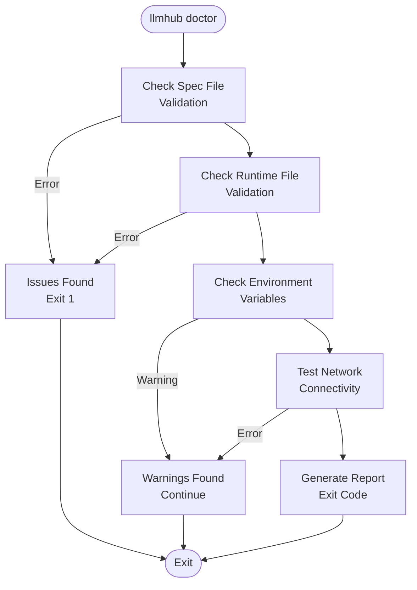
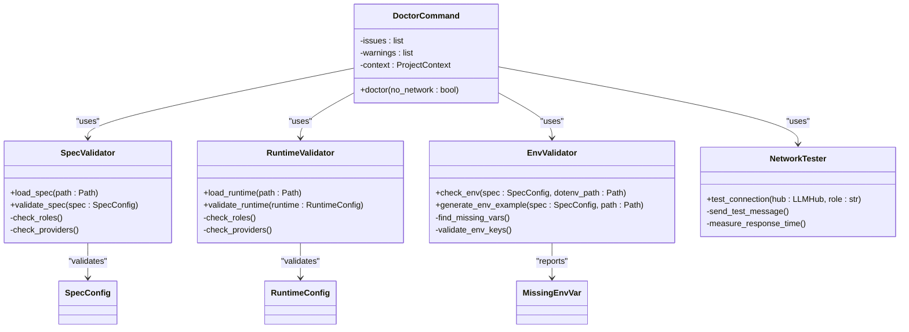
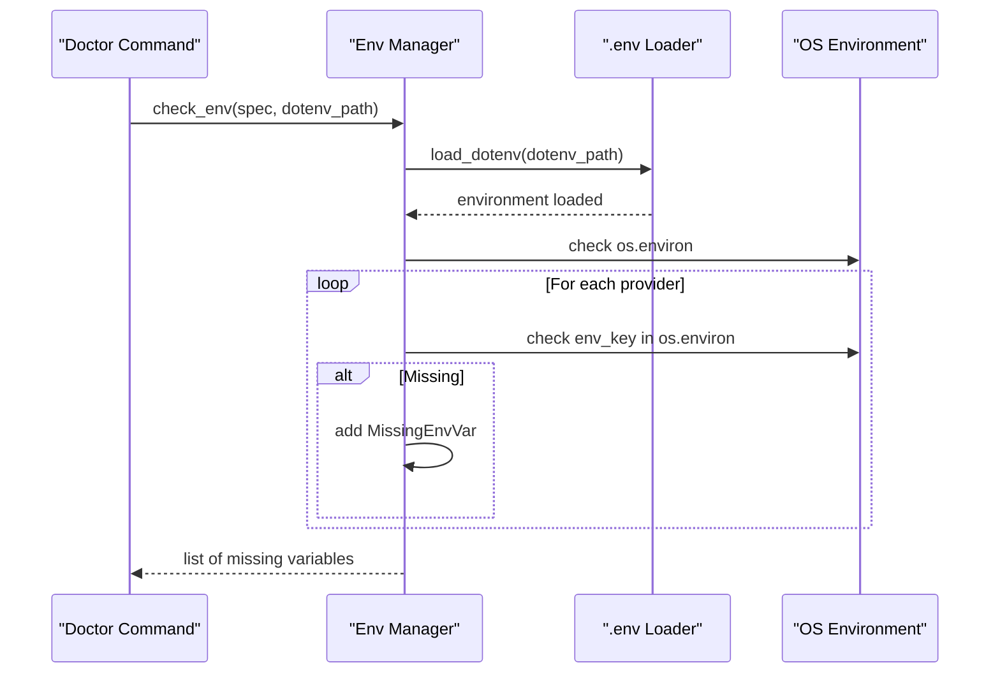
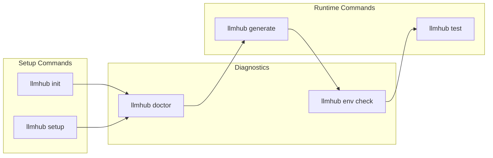

# Environment Diagnostics

<cite>
**Referenced Files in This Document**
- [packages/llmhub/src/llmhub/cli.py](file://packages/llmhub/src/llmhub/cli.py)
- [packages/llmhub/src/llmhub/commands/test_cmd.py](file://packages/llmhub/src/llmhub/commands/test_cmd.py)
- [packages/llmhub/src/llmhub/commands/env_cmd.py](file://packages/llmhub/src/llmhub/commands/env_cmd.py)
- [packages/llmhub/src/llmhub/env_manager.py](file://packages/llmhub/src/llmhub/env_manager.py)
- [packages/llmhub/src/llmhub/ux.py](file://packages/llmhub/src/llmhub/ux.py)
- [packages/llmhub/src/llmhub/spec_models.py](file://packages/llmhub/src/llmhub/spec_models.py)
- [packages/llmhub/src/llmhub/commands/setup_cmd.py](file://packages/llmhub/src/llmhub/commands/setup_cmd.py)
- [packages/llmhub/src/llmhub/commands/runtime_cmd.py](file://packages/llmhub/src/llmhub/commands/runtime_cmd.py)
- [packages/llmhub/pyproject.toml](file://packages/llmhub/pyproject.toml)
</cite>

## Table of Contents
1. [Introduction](#introduction)
2. [Command Overview](#command-overview)
3. [Diagnostic System Architecture](#diagnostic-system-architecture)
4. [Environment Validation Components](#environment-validation-components)
5. [Status Indicators and Output Format](#status-indicators-and-output-format)
6. [Integration with Setup and Runtime Commands](#integration-with-setup-and-runtime-commands)
7. [Common Diagnostic Scenarios](#common-diagnostic-scenarios)
8. [Troubleshooting Guide](#troubleshooting-guide)
9. [Best Practices](#best-practices)
10. [Conclusion](#conclusion)

## Introduction

The `llmhub doctor` command serves as a comprehensive health check and environment diagnostics tool for LLMHub projects. This diagnostic system validates the local development environment by checking spec file integrity, runtime configuration validity, environment variable completeness, and network connectivity. The tool provides structured output with clear status indicators (OK, Warning, Error) and actionable recommendations for resolving issues before proceeding with test execution or deployment.

The diagnostic system is designed to prevent common development pitfalls by ensuring all prerequisites are met before critical operations. It integrates seamlessly with LLMHub's workflow, providing early detection of configuration issues and guiding developers toward resolution.

## Command Overview

The `llmhub doctor` command is accessible through the main CLI interface and performs a four-stage comprehensive health check:



**Diagram sources**
- [packages/llmhub/src/llmhub/commands/test_cmd.py](file://packages/llmhub/src/llmhub/commands/test_cmd.py#L125-L232)

**Section sources**
- [packages/llmhub/src/llmhub/cli.py](file://packages/llmhub/src/llmhub/cli.py#L39)
- [packages/llmhub/src/llmhub/commands/test_cmd.py](file://packages/llmhub/src/llmhub/commands/test_cmd.py#L125-L232)

## Diagnostic System Architecture

The diagnostic system follows a modular architecture with distinct validation stages:



**Diagram sources**
- [packages/llmhub/src/llmhub/commands/test_cmd.py](file://packages/llmhub/src/llmhub/commands/test_cmd.py#L125-L232)
- [packages/llmhub/src/llmhub/env_manager.py](file://packages/llmhub/src/llmhub/env_manager.py#L46-L71)

**Section sources**
- [packages/llmhub/src/llmhub/commands/test_cmd.py](file://packages/llmhub/src/llmhub/commands/test_cmd.py#L125-L232)
- [packages/llmhub/src/llmhub/env_manager.py](file://packages/llmhub/src/llmhub/env_manager.py#L1-L72)

## Environment Validation Components

### 1. Spec File Validation

The spec validation component checks the integrity of the `llmhub.spec.yaml` file:

- **File Existence**: Verifies the presence of the spec file
- **YAML Parsing**: Ensures valid YAML syntax
- **Schema Validation**: Validates against the SpecConfig schema
- **Role Consistency**: Checks role definitions and references
- **Provider Configuration**: Validates provider settings and dependencies

### 2. Runtime Configuration Validation

The runtime validation component examines the generated `llmhub.yaml` file:

- **File Presence**: Confirms runtime file existence
- **Configuration Integrity**: Validates runtime schema compliance
- **Role Mapping**: Ensures role configurations are complete
- **Provider Availability**: Verifies provider accessibility

### 3. Environment Variable Checking

The environment validation system performs comprehensive checks:



**Diagram sources**
- [packages/llmhub/src/llmhub/env_manager.py](file://packages/llmhub/src/llmhub/env_manager.py#L46-L71)

### 4. Network Connectivity Testing

The network testing component validates API connectivity:

- **Provider Authentication**: Tests API key validity
- **Service Availability**: Checks provider endpoints
- **Rate Limiting**: Verifies quota availability
- **Response Time**: Measures connection performance

**Section sources**
- [packages/llmhub/src/llmhub/env_manager.py](file://packages/llmhub/src/llmhub/env_manager.py#L46-L71)
- [packages/llmhub/src/llmhub/commands/test_cmd.py](file://packages/llmhub/src/llmhub/commands/test_cmd.py#L165-L200)

## Status Indicators and Output Format

The diagnostic system uses a standardized color-coded output format with clear status indicators:

### Status Indicator Types

| Status | Color | Symbol | Meaning |
|--------|-------|--------|---------|
| OK | Green | ✓ | All checks passed |
| Warning | Yellow | ⚠ | Issues detected but not blocking |
| Error | Red | ✗ | Critical issues requiring attention |

### Output Structure

Each diagnostic stage produces structured output following this pattern:

```
Stage Description
  [Status Indicator] Check Result (Additional Information)
```

### Example Output Format

```
LLMHub Doctor

1. Checking spec...
  [✓] Spec valid (3 roles)

2. Checking runtime...
  [⚠] No runtime file

3. Checking environment...
  [⚠] 2 variable(s) missing:
    • OPENAI_API_KEY
    • ANTHROPIC_API_KEY

4. Testing network call...
  [✗] Test call failed: Authentication error
```

### Exit Codes

- **0**: All checks passed successfully
- **1**: Issues found (non-blocking warnings) or errors occurred

**Section sources**
- [packages/llmhub/src/llmhub/ux.py](file://packages/llmhub/src/llmhub/ux.py#L97-L106)
- [packages/llmhub/src/llmhub/commands/test_cmd.py](file://packages/llmhub/src/llmhub/commands/test_cmd.py#L133-L200)

## Integration with Setup and Runtime Commands

The diagnostic system integrates seamlessly with LLMHub's workflow commands:



**Diagram sources**
- [packages/llmhub/src/llmhub/commands/setup_cmd.py](file://packages/llmhub/src/llmhub/commands/setup_cmd.py#L16-L118)
- [packages/llmhub/src/llmhub/commands/runtime_cmd.py](file://packages/llmhub/src/llmhub/commands/runtime_cmd.py#L13-L70)

### Pre-Test Validation

Before executing tests, the system automatically runs diagnostics:

1. **Environment Verification**: Ensures all required variables are set
2. **Configuration Validation**: Confirms runtime file integrity
3. **Network Connectivity**: Tests API access
4. **Provider Availability**: Validates service access

### Setup Integration

During initial setup, diagnostics provide immediate feedback:

- **Spec Validation**: Confirms proper spec creation
- **Environment Generation**: Creates `.env.example` templates
- **Provider Configuration**: Guides API key setup
- **Role Definition**: Validates role specifications

**Section sources**
- [packages/llmhub/src/llmhub/commands/setup_cmd.py](file://packages/llmhub/src/llmhub/commands/setup_cmd.py#L16-L118)
- [packages/llmhub/src/llmhub/commands/runtime_cmd.py](file://packages/llmhub/src/llmhub/commands/runtime_cmd.py#L13-L70)

## Common Diagnostic Scenarios

### Scenario 1: Missing Spec File

**Symptoms:**
- Error message: "No spec file found"
- Exit code: 1
- Stage: 1 (Spec Validation)

**Resolution:**
```bash
# Initialize with minimal configuration
llmhub init

# Or run interactive setup
llmhub setup
```

### Scenario 2: Missing Environment Variables

**Symptoms:**
- Warning message: "X variable(s) missing"
- Stage: 3 (Environment Check)
- Specific missing variables listed

**Resolution:**
```bash
# Check current environment
llmhub env check

# Generate environment example
llmhub env sync

# Set variables in .env file
echo "OPENAI_API_KEY=your_api_key_here" >> .env
```

### Scenario 3: Runtime File Issues

**Symptoms:**
- Warning message: "No runtime file found"
- Stage: 2 (Runtime Validation)

**Resolution:**
```bash
# Generate runtime from spec
llmhub generate

# Review generated configuration
llmhub runtime show
```

### Scenario 4: Network Connectivity Problems

**Symptoms:**
- Error message: "Test call failed: Network error"
- Stage: 4 (Network Test)

**Resolution:**
```bash
# Skip network test temporarily
llmhub doctor --no-network

# Check API key validity
export OPENAI_API_KEY=your_key
curl -H "Authorization: Bearer $OPENAI_API_KEY" \
     https://api.openai.com/v1/models
```

### Scenario 5: Provider Authentication Failures

**Symptoms:**
- Error message: "Authentication error"
- Specific provider mentioned

**Resolution:**
```bash
# Verify API key
echo $OPENAI_API_KEY

# Test with curl
curl -H "Authorization: Bearer $OPENAI_API_KEY" \
     https://api.openai.com/v1/models

# Regenerate runtime with correct credentials
llmhub generate --force
```

**Section sources**
- [packages/llmhub/src/llmhub/commands/test_cmd.py](file://packages/llmhub/src/llmhub/commands/test_cmd.py#L136-L200)
- [packages/llmhub/src/llmhub/commands/env_cmd.py](file://packages/llmhub/src/llmhub/commands/env_cmd.py#L44-L80)

## Troubleshooting Guide

### Environment Variable Issues

**Problem**: Environment variables not recognized despite being set

**Diagnosis Steps:**
1. Run `llmhub env check` to identify missing variables
2. Check `.env` file location and format
3. Verify variable names match spec requirements

**Solutions:**
- Use `llmhub env sync` to regenerate `.env.example`
- Export variables directly: `export OPENAI_API_KEY=value`
- Verify `.env` file syntax: `KEY=value` (no spaces around `=`)

### Spec Validation Errors

**Problem**: Spec file validation failures

**Common Causes:**
- Invalid YAML syntax
- Missing required fields
- Invalid enum values
- Role definition conflicts

**Resolution Process:**
1. Check YAML syntax with external validator
2. Review spec schema requirements
3. Compare with `.env.example` template
4. Use `llmhub spec validate` for detailed validation

### Runtime Generation Issues

**Problem**: Runtime generation fails or produces invalid configuration

**Diagnostic Approach:**
1. Run `llmhub doctor` to identify root causes
2. Check provider availability and API access
3. Verify role preferences and constraints
4. Review generated runtime file manually

### Network Connectivity Problems

**Problem**: Network tests fail despite working API keys

**Troubleshooting Steps:**
1. Test with `--no-network` flag to isolate issues
2. Check firewall and proxy settings
3. Verify DNS resolution
4. Test with direct API calls

**Section sources**
- [packages/llmhub/src/llmhub/commands/env_cmd.py](file://packages/llmhub/src/llmhub/commands/env_cmd.py#L44-L80)
- [packages/llmhub/src/llmhub/commands/test_cmd.py](file://packages/llmhub/src/llmhub/commands/test_cmd.py#L165-L200)

## Best Practices

### Development Workflow Integration

1. **Pre-Commit Validation**: Run `llmhub doctor` before committing changes
2. **CI/CD Pipeline**: Include diagnostics in automated testing
3. **Regular Health Checks**: Schedule periodic environment validation
4. **Documentation Updates**: Keep diagnostic output in project documentation

### Environment Management

1. **Version Control**: Track `.env.example` but not `.env` files
2. **Secret Management**: Use appropriate secret management systems
3. **Environment Separation**: Maintain separate configurations for dev/staging/prod
4. **Documentation**: Document all required environment variables

### Error Resolution Strategy

1. **Systematic Approach**: Address issues in order of severity
2. **Incremental Testing**: Test each fix individually
3. **Backup Configurations**: Maintain working configuration backups
4. **Logging**: Enable verbose logging for complex issues

### Performance Optimization

1. **Network Testing**: Use `--no-network` flag for local development
2. **Selective Validation**: Focus on relevant diagnostic stages
3. **Caching**: Leverage cached environment variables
4. **Parallel Processing**: Run independent checks concurrently

**Section sources**
- [packages/llmhub/src/llmhub/commands/test_cmd.py](file://packages/llmhub/src/llmhub/commands/test_cmd.py#L125-L232)
- [packages/llmhub/src/llmhub/env_manager.py](file://packages/llmhub/src/llmhub/env_manager.py#L15-L45)

## Conclusion

The `llmhub doctor` command provides a comprehensive environment diagnostics solution that ensures LLMHub projects are properly configured before critical operations. Through its four-stage validation process—spec validation, runtime verification, environment checking, and network testing—the system prevents common development issues and provides clear guidance for resolution.

The diagnostic system's integration with setup and runtime commands creates a seamless workflow where environment readiness is validated automatically. The structured output format with clear status indicators and actionable recommendations makes it easy for developers to identify and resolve issues quickly.

Key benefits of the diagnostic system include:
- **Early Issue Detection**: Identifies problems before they cause failures
- **Structured Reporting**: Provides clear, actionable feedback
- **Workflow Integration**: Seamlessly fits into existing development processes
- **Extensible Design**: Supports future enhancements and additional validation checks

By leveraging the `llmhub doctor` command as part of your development workflow, you can maintain a healthy, reliable LLMHub environment that minimizes downtime and maximizes productivity.