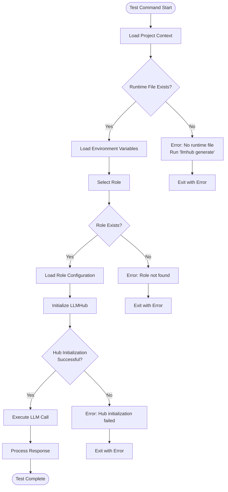
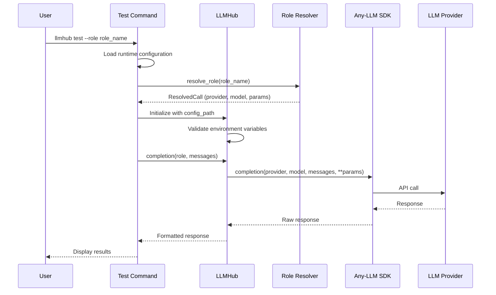
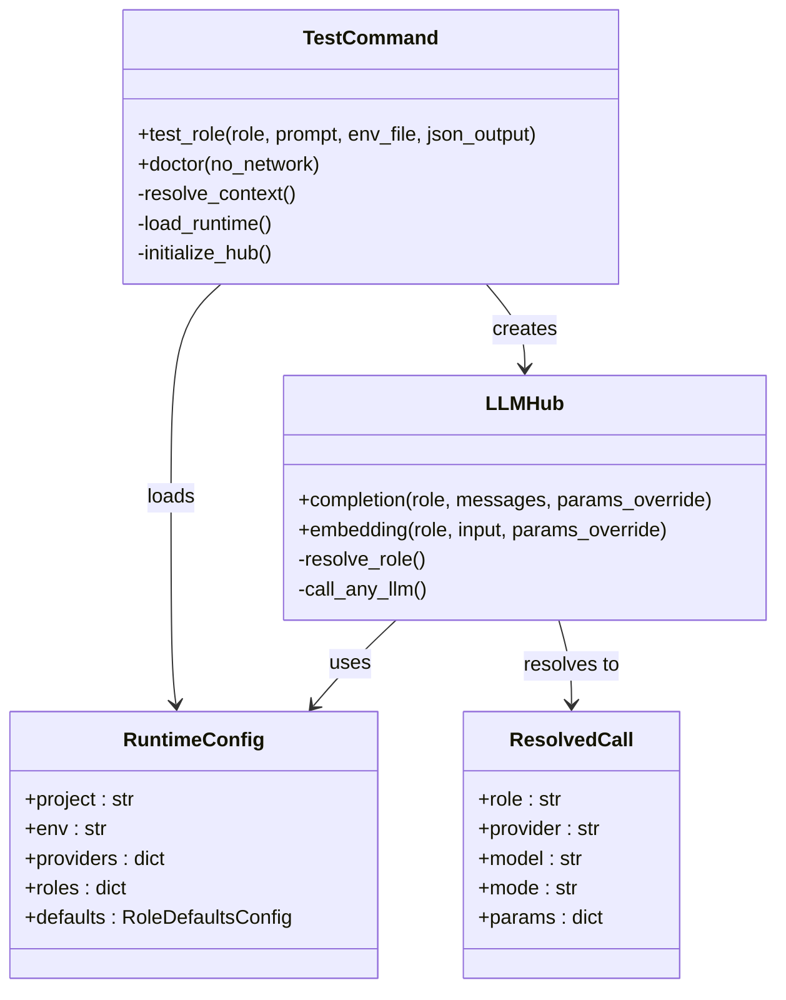
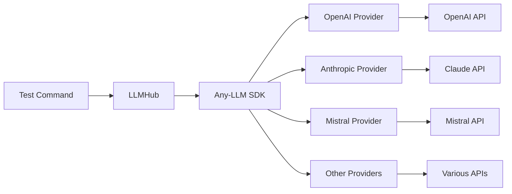
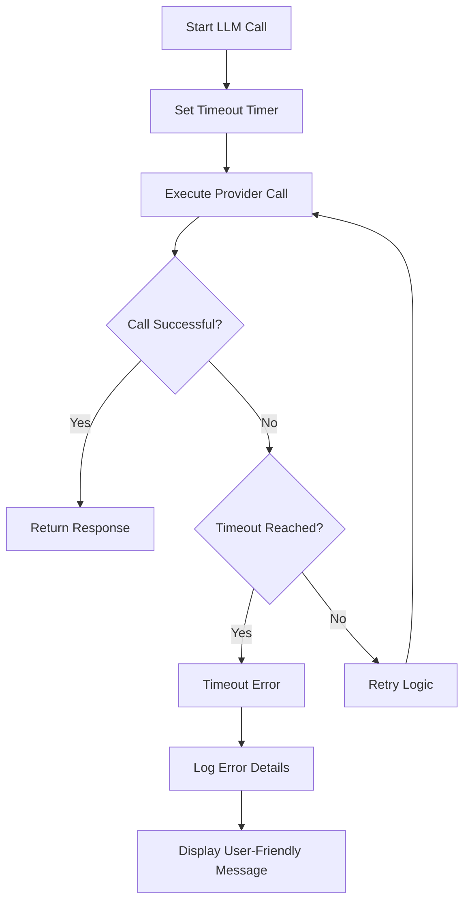

# Interactive Role Testing

<cite>
**Referenced Files in This Document**
- [test_cmd.py](file://packages/llmhub/src/llmhub/commands/test_cmd.py)
- [cli.py](file://packages/llmhub/src/llmhub/cli.py)
- [hub.py](file://packages/llmhub_runtime/src/llmhub_runtime/hub.py)
- [resolver.py](file://packages/llmhub_runtime/src/llmhub_runtime/resolver.py)
- [errors.py](file://packages/llmhub_runtime/src/llmhub_runtime/errors.py)
- [context.py](file://packages/llmhub/src/llmhub/context.py)
- [llmhub.yaml](file://packages/llmhub_runtime/tests/fixtures/llmhub.yaml)
- [test_hub_basic.py](file://packages/llmhub_runtime/tests/test_hub_basic.py)
- [test_resolver.py](file://packages/llmhub_runtime/tests/test_resolver.py)
</cite>

## Table of Contents
1. [Introduction](#introduction)
2. [Command Overview](#command-overview)
3. [Command Syntax and Arguments](#command-syntax-and-arguments)
4. [Role Resolution Process](#role-resolution-process)
5. [LLM Execution Workflow](#llm-execution-workflow)
6. [Expected Output and Response Formats](#expected-output-and-response-formats)
7. [Practical Examples](#practical-examples)
8. [Integration with Runtime Library](#integration-with-runtime-library)
9. [Any-LLM Integration](#any-llm-integration)
10. [Common Issues and Troubleshooting](#common-issues-and-troubleshooting)
11. [Advanced Features](#advanced-features)
12. [Best Practices](#best-practices)

## Introduction

The `llmhub test` command provides an interactive interface for validating role-to-model resolution and LLM execution against your current configuration. This powerful tool enables developers to quickly test roles defined in their `llmhub.spec.yaml` file, ensuring that the role-to-provider mapping works correctly and that actual LLM calls can be made successfully.

The testing functionality bridges the gap between configuration validation and real-world LLM interactions, offering immediate feedback on role resolution, provider authentication, and model availability. It serves as both a development aid during configuration setup and a diagnostic tool for troubleshooting production issues.

## Command Overview

The `llmhub test` command offers two primary testing modes:

### Basic Testing Mode
```bash
llmhub test [--role ROLE_NAME] [--prompt PROMPT_TEXT] [--env-file ENV_PATH] [--json]
```

### Health Check Mode
```bash
llmhub doctor [--no-network]
```

The command performs comprehensive validation including:
- Role existence verification
- Provider configuration validation
- Environment variable checking
- Network connectivity testing
- Actual LLM call execution

## Command Syntax and Arguments

### Core Arguments

| Argument | Type | Description | Default |
|----------|------|-------------|---------|
| `--role` | String | Specific role to test (optional) | None |
| `--prompt` | String | Custom prompt for testing (optional) | "Hello, how are you?" |
| `--env-file` | String | Path to custom .env file (optional) | Auto-detected |
| `--json` | Boolean | Output raw JSON response instead of formatted text | False |

### Advanced Options

| Option | Description | Use Case |
|--------|-------------|----------|
| `--no-network` | Skip network test calls in doctor mode | Offline environments |
| `--dry-run` | Preview what would happen without executing | Planning mode |

### Interactive Prompts

When arguments are omitted, the command provides interactive prompts:
- Role selection from available roles
- Prompt input with default suggestions
- Environment file selection

**Section sources**
- [test_cmd.py](file://packages/llmhub/src/llmhub/commands/test_cmd.py#L18-L23)

## Role Resolution Process

The role testing process follows a systematic resolution pipeline that ensures proper mapping from logical roles to concrete LLM configurations.



**Diagram sources**
- [test_cmd.py](file://packages/llmhub/src/llmhub/commands/test_cmd.py#L25-L118)

### Resolution Steps

1. **Context Resolution**: Determines project root and file locations
2. **Environment Loading**: Applies environment variables from `.env` files
3. **Role Selection**: Validates role existence and retrieves configuration
4. **Hub Initialization**: Creates LLMHub instance with resolved configuration
5. **Call Execution**: Performs actual LLM operation based on role mode

**Section sources**
- [test_cmd.py](file://packages/llmhub/src/llmhub/commands/test_cmd.py#L44-L78)
- [resolver.py](file://packages/llmhub_runtime/src/llmhub_runtime/resolver.py#L5-L43)

## LLM Execution Workflow

The LLM execution process adapts to different role modes, supporting various types of LLM operations.



**Diagram sources**
- [test_cmd.py](file://packages/llmhub/src/llmhub/commands/test_cmd.py#L80-L118)
- [hub.py](file://packages/llmhub_runtime/src/llmhub_runtime/hub.py#L61-L109)

### Mode-Specific Execution

| Role Mode | Method Called | Input Format | Expected Output |
|-----------|---------------|--------------|-----------------|
| `chat` | `completion()` | `[{"role": "user", "content": "prompt"}]` | Chat response |
| `embedding` | `embedding()` | String or List of strings | Embedding vectors |
| `image` | N/A | N/A | Image generation |
| `audio` | N/A | N/A | Audio processing |
| `tool` | N/A | N/A | Tool execution |

**Section sources**
- [test_cmd.py](file://packages/llmhub/src/llmhub/commands/test_cmd.py#L82-L87)
- [hub.py](file://packages/llmhub_runtime/src/llmhub_runtime/hub.py#L61-L109)

## Expected Output and Response Formats

The test command provides structured output displaying key information about the testing process and results.

### Standard Output Format

```
Testing role: llm.inference
Provider: openai
Model: gpt-4
Mode: chat

✓ Call successful
Duration: 1.23s

Response:
Hello! How can I assist you today?
```

### Embedding Mode Output

```
Testing role: llm.embedding
Provider: openai
Model: text-embedding-3-small
Mode: embedding

✓ Call successful
Duration: 0.45s

Embeddings: Generated 1 embedding(s)
```

### JSON Output Format

When using `--json` flag, the raw response from the LLM provider is displayed:

```json
{
  "id": "chatcmpl-123",
  "object": "chat.completion",
  "created": 1642345678,
  "model": "gpt-4",
  "choices": [
    {
      "index": 0,
      "message": {
        "role": "assistant",
        "content": "Hello! How can I help you today?"
      },
      "finish_reason": "stop"
    }
  ],
  "usage": {
    "prompt_tokens": 10,
    "completion_tokens": 8,
    "total_tokens": 18
  }
}
```

### Error Output Format

```
✗ Call failed: Authentication error - invalid API key

Possible issues:
  • Missing or invalid API key
  • Network connectivity
  • Invalid model name
```

**Section sources**
- [test_cmd.py](file://packages/llmhub/src/llmhub/commands/test_cmd.py#L91-L110)

## Practical Examples

### Basic Role Testing

Test a specific role with default prompt:
```bash
llmhub test --role llm.inference
```

### Custom Prompt Testing
```bash
llmhub test --role llm.preprocess --prompt "Translate this sentence to French: Hello world"
```

### JSON Output for Scripting
```bash
llmhub test --role llm.inference --prompt "What is AI?" --json
```

### Testing with Custom Environment
```bash
llmhub test --role llm.inference --env-file ./custom.env
```

### Interactive Role Selection
```bash
llmhub test
```
This presents a menu of available roles for selection.

### Embedding Role Testing
```bash
llmhub test --role llm.embedding --prompt "This is a test sentence"
```

### Doctor Mode for Health Checks
```bash
llmhub doctor
```

**Section sources**
- [test_cmd.py](file://packages/llmhub/src/llmhub/commands/test_cmd.py#L44-L65)

## Integration with Runtime Library

The `llmhub test` command seamlessly integrates with the `llmhub_runtime` library, leveraging its robust architecture for LLM operations.

### Architecture Integration



**Diagram sources**
- [test_cmd.py](file://packages/llmhub/src/llmhub/commands/test_cmd.py#L8-L9)
- [hub.py](file://packages/llmhub_runtime/src/llmhub_runtime/hub.py#L17-L51)
- [resolver.py](file://packages/llmhub_runtime/src/llmhub_runtime/resolver.py#L5-L43)

### Configuration Loading

The test command loads runtime configuration through standardized mechanisms:

1. **Path Resolution**: Uses project context to locate `llmhub.yaml`
2. **Validation**: Ensures configuration integrity before testing
3. **Environment Integration**: Applies environment variables automatically
4. **Fallback Handling**: Manages missing or invalid configurations gracefully

**Section sources**
- [test_cmd.py](file://packages/llmhub/src/llmhub/commands/test_cmd.py#L41-L43)
- [context.py](file://packages/llmhub/src/llmhub/context.py#L49-L89)

## Any-LLM Integration

The testing functionality leverages the `any-llm` SDK for universal LLM provider support, enabling seamless integration with multiple LLM platforms.

### Provider Abstraction



**Diagram sources**
- [hub.py](file://packages/llmhub_runtime/src/llmhub_runtime/hub.py#L102-L108)
- [hub.py](file://packages/llmhub_runtime/src/llmhub_runtime/hub.py#L166-L171)

### SDK Integration Features

| Feature | Description | Benefit |
|---------|-------------|---------|
| **Universal API** | Single interface for all providers | Consistent behavior across providers |
| **Automatic Fallback** | Provider switching on failures | Improved reliability |
| **Rate Limiting** | Built-in rate limit handling | Better API usage |
| **Caching** | Response caching for repeated calls | Cost and speed optimization |

### Error Handling Integration

The integration provides comprehensive error handling:
- Provider-specific error translation
- Network timeout management
- Authentication failure detection
- Rate limit response processing

**Section sources**
- [hub.py](file://packages/llmhub_runtime/src/llmhub_runtime/hub.py#L102-L108)
- [hub.py](file://packages/llmhub_runtime/src/llmhub_runtime/hub.py#L166-L171)

## Common Issues and Troubleshooting

### Unresolved Roles

**Problem**: Role not found in runtime configuration
```
✗ Role 'llm.nonexistent' not found in runtime
```

**Solution**: 
1. Run `llmhub generate` to update runtime from spec
2. Verify role exists in `llmhub.spec.yaml`
3. Check for typos in role name

### Authentication Errors

**Problem**: API key authentication failures
```
✗ Call failed: Authentication error - invalid API key
```

**Solution**:
1. Verify environment variables are set
2. Check `.env` file contains correct API keys
3. Run `llmhub env check` to validate environment setup

### Network Connectivity Issues

**Problem**: Unable to reach LLM provider
```
✗ Call failed: Network timeout
```

**Solution**:
1. Check internet connection
2. Verify firewall settings
3. Test with `llmhub doctor --no-network` to isolate network issues

### Missing Runtime File

**Problem**: No runtime configuration found
```
✗ No runtime file found at ./llmhub.yaml
Run 'llmhub generate' first
```

**Solution**:
1. Run `llmhub generate` to create runtime configuration
2. Ensure `llmhub.spec.yaml` exists and is valid
3. Check project context resolution

### Timeout Handling

The system implements robust timeout handling:



**Diagram sources**
- [test_cmd.py](file://packages/llmhub/src/llmhub/commands/test_cmd.py#L112-L118)

### Doctor Mode Diagnostics

The `llmhub doctor` command provides comprehensive health checking:

1. **Spec Validation**: Verifies `llmhub.spec.yaml` syntax and structure
2. **Runtime Validation**: Checks `llmhub.yaml` integrity
3. **Environment Check**: Validates required environment variables
4. **Network Test**: Attempts actual LLM calls (when network enabled)

**Section sources**
- [test_cmd.py](file://packages/llmhub/src/llmhub/commands/test_cmd.py#L125-L231)

## Advanced Features

### Environment File Management

The test command supports custom environment files for isolated testing:

```bash
# Test with specific environment
llmhub test --role llm.inference --env-file ./test.env

# Test with multiple environments
export OPENAI_API_KEY=test_key && llmhub test --role llm.inference
```

### Parameter Override

While the test command doesn't expose parameter overrides directly, the underlying LLMHub supports this through its API:

```python
# Programmatic override example
hub = LLMHub(config_path="llmhub.yaml")
response = hub.completion(
    role="llm.inference",
    messages=[{"role": "user", "content": "Hello"}],
    params_override={"temperature": 0.1}
)
```

### Hook Integration

The LLMHub supports pre/post-call hooks for monitoring and logging:

```python
def log_call(context):
    print(f"Calling {context['provider']}::{context['model']}")

def log_response(result):
    print(f"Success: {result['success']}")

hub = LLMHub(
    config_path="llmhub.yaml",
    on_before_call=log_call,
    on_after_call=log_response
)
```

**Section sources**
- [test_cmd.py](file://packages/llmhub/src/llmhub/commands/test_cmd.py#L34-L39)
- [hub.py](file://packages/llmhub_runtime/src/llmhub_runtime/hub.py#L22-L25)

## Best Practices

### Development Workflow

1. **Initial Setup**: Use `llmhub init` to create baseline configuration
2. **Configuration Testing**: Regularly use `llmhub test` to validate role setups
3. **Environment Isolation**: Use custom `.env` files for different testing scenarios
4. **Health Monitoring**: Periodic `llmhub doctor` runs for production readiness

### Role Design Guidelines

- **Descriptive Names**: Use clear, meaningful role identifiers
- **Consistent Patterns**: Follow established naming conventions
- **Purpose Clarity**: Document role descriptions thoroughly
- **Parameter Defaults**: Set sensible default parameters in runtime

### Error Prevention

- **Environment Validation**: Always run `llmhub env check` before testing
- **Configuration Updates**: Regenerate runtime after spec changes
- **API Key Management**: Store keys securely and rotate regularly
- **Network Monitoring**: Test connectivity in target environments

### Performance Optimization

- **Caching Strategy**: Leverage embedding caching for repeated operations
- **Model Selection**: Choose appropriate models for different use cases
- **Parameter Tuning**: Optimize temperature and other parameters for quality
- **Batch Processing**: Group related operations when possible

**Section sources**
- [test_cmd.py](file://packages/llmhub/src/llmhub/commands/test_cmd.py#L125-L231)