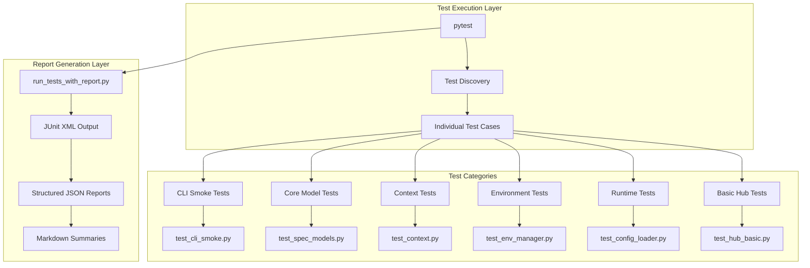
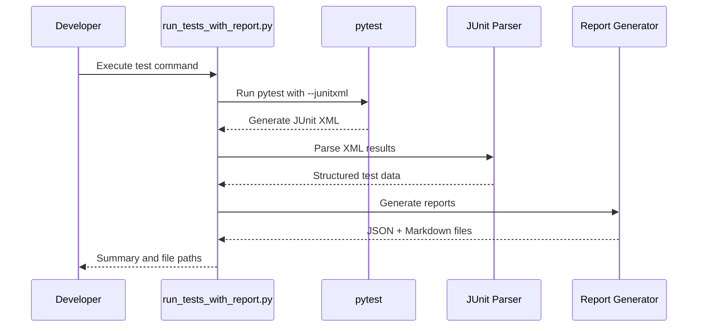
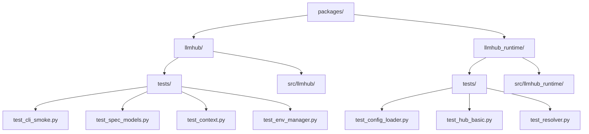
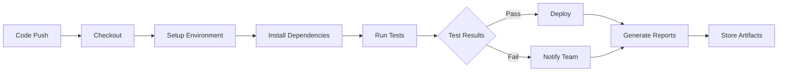

# Running Tests

<cite>
**Referenced Files in This Document**
- [test_cli_smoke.py](file://packages/llmhub/tests/test_cli_smoke.py)
- [test_spec_models.py](file://packages/llmhub/tests/test_spec_models.py)
- [run_tests_with_report.py](file://packages/llmhub/src/llmhub/tools/run_tests_with_report.py)
- [pyproject.toml](file://packages/llmhub/pyproject.toml)
- [pytest.ini](file://pytest.ini)
- [Makefile](file://Makefile)
- [test_context.py](file://packages/llmhub/tests/test_context.py)
- [test_env_manager.py](file://packages/llmhub/tests/test_env_manager.py)
- [test_config_loader.py](file://packages/llmhub_runtime/tests/test_config_loader.py)
- [test_hub_basic.py](file://packages/llmhub_runtime/tests/test_hub_basic.py)
- [test_cmd.py](file://packages/llmhub/src/llmhub/commands/test_cmd.py)
</cite>

## Table of Contents
1. [Introduction](#introduction)
2. [Test Infrastructure Overview](#test-infrastructure-overview)
3. [Test Dependencies and Setup](#test-dependencies-and-setup)
4. [Running Tests with pytest](#running-tests-with-pytest)
5. [Using the Test Report Tool](#using-the-test-report-tool)
6. [Test Organization and Structure](#test-organization-and-structure)
7. [CI/CD Integration](#cicd-integration)
8. [Best Practices](#best-practices)
9. [Troubleshooting](#troubleshooting)
10. [Exit Codes and Output Interpretation](#exit-codes-and-output-interpretation)

## Introduction

LLM Hub provides a comprehensive testing framework built on pytest that enables developers to validate the functionality of the CLI, runtime components, and core business logic. The testing infrastructure supports both basic test execution and sophisticated reporting capabilities, making it suitable for development workflows and CI/CD pipelines.

The testing system encompasses multiple packages within the monorepo, including the main `llmhub` package and the `llmhub_runtime` package, each containing targeted test suites for their respective components.

## Test Infrastructure Overview

The LLM Hub testing infrastructure consists of several key components that work together to provide comprehensive test coverage and reporting:



**Diagram sources**
- [run_tests_with_report.py](file://packages/llmhub/src/llmhub/tools/run_tests_with_report.py#L75-L102)
- [test_cli_smoke.py](file://packages/llmhub/tests/test_cli_smoke.py#L1-L165)
- [test_spec_models.py](file://packages/llmhub/tests/test_spec_models.py#L1-L128)

**Section sources**
- [run_tests_with_report.py](file://packages/llmhub/src/llmhub/tools/run_tests_with_report.py#L1-L396)
- [pyproject.toml](file://packages/llmhub/pyproject.toml#L51-L56)

## Test Dependencies and Setup

### Core Dependencies

The LLM Hub testing framework relies on several key dependencies that are automatically managed through the project configuration:

| Dependency | Version | Purpose |
|------------|---------|---------|
| pytest | Latest | Core testing framework |
| pytest-cov | Latest | Coverage reporting |
| typer-testing | Latest | CLI testing utilities |
| rich | Latest | Enhanced console output |
| python-dotenv | Latest | Environment variable loading |

### Package-Specific Dependencies

Each package maintains its own dependency configuration:

**Main LLM Hub Package (`packages/llmhub`)**:
- Core dependencies: `llmhub-runtime>=1.0.3`, `typer>=0.9.0`, `pyyaml>=6.0`, `pydantic>=2.0`
- Test-specific: `pytest`, `pytest-cov`, `typer-testing`

**Runtime Package (`packages/llmhub_runtime`)**:
- Core dependencies: `any-llm-sdk[all]>=1.2.0`, `pyyaml>=6.0`, `pydantic>=2.0`
- Test-specific: `pytest`, `pytest-cov`

### Environment Configuration

To prepare your environment for testing:

1. **Install Development Dependencies**:
   ```bash
   pip install -e packages/llmhub_runtime
   pip install -e packages/llmhub
   ```

2. **Verify Installation**:
   ```bash
   python -c "import llmhub; import llmhub_runtime; print('Dependencies installed successfully')"
   ```

3. **Set Up Test Environment Variables** (optional but recommended):
   ```bash
   # Create .env file for testing
   echo "OPENAI_API_KEY=test_key" > .env
   echo "ANTHROPIC_API_KEY=test_key" >> .env
   ```

**Section sources**
- [pyproject.toml](file://packages/llmhub/pyproject.toml#L27-L36)
- [packages/llmhub_runtime/pyproject.toml](file://packages/llmhub_runtime/pyproject.toml#L27-L31)

## Running Tests with pytest

### Basic Test Execution

The simplest way to run the test suite is using pytest directly:

```bash
# Run all tests in the packages directory
pytest packages/

# Verbose output with detailed test results
pytest packages/ -v

# Run specific test file
pytest packages/llmhub/tests/test_cli_smoke.py

# Run specific test class
pytest packages/llmhub/tests/test_spec_models.py::TestSpecConfig

# Run specific test function
pytest packages/llmhub/tests/test_env_manager.py::test_check_env_missing_vars
```

### Advanced pytest Options

```bash
# Run tests with coverage reporting
pytest packages/ --cov=llmhub --cov-report=html

# Run tests with specific markers
pytest packages/ -m "smoke"

# Run tests with xdist for parallel execution
pytest packages/ -n auto

# Capture all output including stdout/stderr
pytest packages/ -s

# Stop on first failure
pytest packages/ -x

# Run tests with detailed traceback
pytest packages/ -v --tb=long
```

### Test Filtering and Selection

The pytest configuration supports various filtering mechanisms:

```bash
# Run only tests matching pattern
pytest packages/ -k "test_*_command"

# Run tests excluding specific patterns
pytest packages/ -k "not test_integration"

# Run tests with specific markers
pytest packages/ -m "not slow"
```

**Section sources**
- [pytest.ini](file://pytest.ini#L1-L10)
- [pyproject.toml](file://packages/llmhub/pyproject.toml#L51-L56)

## Using the Test Report Tool

### Introduction to run_tests_with_report.py

The `run_tests_with_report.py` script serves as the primary entry point for generating structured test execution reports. It combines pytest execution with comprehensive reporting capabilities, producing both JSON and Markdown formats for easy consumption by humans and machines.

### Command Line Usage

```bash
# Generate test report with full execution details
python -m llmhub.tools.run_tests_with_report

# The script automatically:
# 1. Runs pytest with JUnit XML output
# 2. Parses results into structured format
# 3. Generates JSON and Markdown reports
# 4. Provides detailed summary output
```

### Report Generation Process



**Diagram sources**
- [run_tests_with_report.py](file://packages/llmhub/src/llmhub/tools/run_tests_with_report.py#L75-L102)
- [run_tests_with_report.py](file://packages/llmhub/src/llmhub/tools/run_tests_with_report.py#L105-L243)

### Report Output Format

The tool generates two complementary report formats:

**JSON Report Structure**:
```json
{
  "project": "llm-hub",
  "run_id": "TER-YYYYMMDD-HHMM-SHORT_SHA",
  "commit": "full_commit_hash",
  "branch": "current_branch",
  "timestamp": "iso_timestamp",
  "environment": {
    "python_version": "3.x.x",
    "os": "Platform_info",
    "llmhub_version": "1.0.3"
  },
  "summary": {
    "total_tests": 42,
    "passed": 38,
    "failed": 2,
    "skipped": 2,
    "errors": 0,
    "duration_seconds": 15.234,
    "status": "passed"
  },
  "suites": [...]
}
```

**Markdown Report Features**:
- Human-readable summaries
- Failed test identification
- Error message extraction
- Duration analysis
- Git integration metadata

### Makefile Integration

The Makefile provides convenient shortcuts for test execution:

```bash
# Standard test execution
make test

# Generate comprehensive test report
make test-report
```

**Section sources**
- [run_tests_with_report.py](file://packages/llmhub/src/llmhub/tools/run_tests_with_report.py#L1-L396)
- [Makefile](file://Makefile#L8-L24)

## Test Organization and Structure

### Directory Structure

The LLM Hub test suite follows a hierarchical organization that mirrors the main package structure:



**Diagram sources**
- [test_cli_smoke.py](file://packages/llmhub/tests/test_cli_smoke.py#L1-L165)
- [test_spec_models.py](file://packages/llmhub/tests/test_spec_models.py#L1-L128)
- [test_config_loader.py](file://packages/llmhub_runtime/tests/test_config_loader.py#L1-L26)

### Test Categories

#### CLI Smoke Tests
[`test_cli_smoke.py`](file://packages/llmhub/tests/test_cli_smoke.py) validates fundamental CLI operations:
- Command-line interface functionality
- Basic workflow validation (init → generate → env sync)
- Integration between CLI commands
- Error handling and edge cases

#### Core Model Tests
[`test_spec_models.py`](file://packages/llmhub/tests/test_spec_models.py) focuses on data model validation:
- Specification configuration creation
- Role specification validation
- Provider configuration testing
- Serialization/deserialization

#### Context Management Tests
[`test_context.py`](file://packages/llmhub/tests/test_context.py) ensures proper project context resolution:
- Project root detection
- Configuration file discovery
- Path resolution logic
- Context override functionality

#### Environment Management Tests
[`test_env_manager.py`](file://packages/llmhub/tests/test_env_manager.py) validates environment variable handling:
- Environment variable generation
- Validation and missing variable detection
- Dotenv file loading
- Provider-specific validation

#### Runtime Tests
[`test_config_loader.py`](file://packages/llmhub_runtime/tests/test_config_loader.py) and [`test_hub_basic.py`](file://packages/llmhub_runtime/tests/test_hub_basic.py) test the runtime component:
- Configuration loading and parsing
- LLMHub initialization
- Provider communication
- Hook system functionality

### Test Patterns and Conventions

The test suite follows consistent patterns:

1. **Fixture Usage**: Shared test data and setup through pytest fixtures
2. **Parameterized Testing**: Multiple scenarios for single functionality
3. **Mock Integration**: External dependencies controlled through mocking
4. **Error Boundary Testing**: Comprehensive error condition validation
5. **Integration Testing**: Cross-component functionality validation

**Section sources**
- [test_cli_smoke.py](file://packages/llmhub/tests/test_cli_smoke.py#L1-L165)
- [test_spec_models.py](file://packages/llmhub/tests/test_spec_models.py#L1-L128)
- [test_context.py](file://packages/llmhub/tests/test_context.py#L1-L83)
- [test_env_manager.py](file://packages/llmhub/tests/test_env_manager.py#L1-L139)

## CI/CD Integration

### GitHub Actions Integration

The LLM Hub testing framework is designed to integrate seamlessly with CI/CD pipelines:

```yaml
# Example GitHub Actions workflow
name: Test Suite
on: [push, pull_request]
jobs:
  test:
    runs-on: ubuntu-latest
    steps:
      - uses: actions/checkout@v4
      - name: Set up Python
        uses: actions/setup-python@v4
        with:
          python-version: '3.11'
      - name: Install dependencies
        run: |
          pip install -e packages/llmhub_runtime
          pip install -e packages/llmhub
      - name: Run tests with report
        run: make test-report
      - name: Upload test reports
        uses: actions/upload-artifact@v3
        with:
          name: test-reports
          path: reports/test-execution/
```

### Continuous Integration Best Practices

#### Test Execution Timing
- **Pre-commit Hooks**: Run smoke tests before commits
- **Pull Request Validation**: Execute full test suite on PR creation
- **Scheduled Builds**: Weekly regression testing
- **Release Validation**: Comprehensive testing before releases

#### Test Filtering Strategies
```bash
# Quick feedback loop
pytest packages/llmhub/tests/test_cli_smoke.py -v

# Full regression testing
make test-report

# Targeted testing during development
pytest packages/llmhub/tests/test_spec_models.py -v
```

#### Resource Management
- **Parallel Execution**: Utilize multiple CPU cores for faster execution
- **Memory Optimization**: Monitor memory usage in long-running tests
- **Network Isolation**: Mock external APIs for reliable CI execution
- **Cleanup Procedures**: Ensure test isolation and resource cleanup

### Pipeline Integration Points



**Section sources**
- [run_tests_with_report.py](file://packages/llmhub/src/llmhub/tools/run_tests_with_report.py#L310-L396)
- [Makefile](file://Makefile#L8-L24)

## Best Practices

### Test Development Guidelines

#### Writing Effective Tests
1. **Single Responsibility**: Each test should verify one specific behavior
2. **Descriptive Naming**: Use clear, descriptive test names
3. **Proper Setup/Teardown**: Ensure test isolation and cleanup
4. **Meaningful Assertions**: Validate expected outcomes comprehensively

#### Test Organization
```python
# Good: Descriptive test function
def test_spec_config_creation():
    """Test creating a minimal SpecConfig."""
    spec = SpecConfig(project="test", ...)
    assert spec.project == "test"

# Good: Parameterized test for multiple scenarios
@pytest.mark.parametrize("provider_name", ["openai", "anthropic"])
def test_provider_configuration(provider_name):
    """Test provider configuration for different providers."""
    config = SpecProviderConfig(enabled=True, env_key=f"{provider_name}_KEY")
    assert config.enabled is True
```

#### Mock Usage Best Practices
- **External Dependencies**: Mock network calls and file operations
- **State Management**: Use fixtures for shared test state
- **Isolation**: Ensure mocks don't leak between tests

### Performance Optimization

#### Test Execution Strategies
- **Parallel Execution**: Use pytest-xdist for concurrent test execution
- **Selective Testing**: Focus on changed components during development
- **Resource Management**: Optimize memory usage in long-running tests

#### Reporting Optimization
- **Incremental Reports**: Generate reports incrementally for large test suites
- **Compression**: Compress report artifacts for storage efficiency
- **Caching**: Cache test results when appropriate

### Maintenance and Updates

#### Keeping Tests Current
- **Regular Review**: Periodically review and update test suites
- **Refactoring**: Refactor tests alongside code changes
- **Documentation**: Maintain clear test documentation

#### Test Quality Metrics
- **Coverage Tracking**: Monitor test coverage metrics
- **Flaky Test Detection**: Identify and fix intermittent failures
- **Performance Monitoring**: Track test execution times

**Section sources**
- [test_cli_smoke.py](file://packages/llmhub/tests/test_cli_smoke.py#L15-L165)
- [test_spec_models.py](file://packages/llmhub/tests/test_spec_models.py#L10-L128)

## Troubleshooting

### Common Issues and Solutions

#### Dependency Resolution Problems
```bash
# Issue: Missing dependencies
# Solution: Reinstall with development dependencies
pip uninstall llmhub llmhub-runtime
pip install -e packages/llmhub_runtime
pip install -e packages/llmhub

# Issue: Version conflicts
# Solution: Check dependency compatibility
pip list | grep -E "(llmhub|pytest|typer)"
```

#### Environment Configuration Issues
```bash
# Issue: Missing environment variables
# Solution: Set up .env file
cat > .env << EOF
OPENAI_API_KEY=your_api_key_here
ANTHROPIC_API_KEY=your_api_key_here
EOF

# Issue: Permission errors
# Solution: Check file permissions
chmod 600 .env
```

#### Test Execution Failures
```bash
# Issue: Test timeouts
# Solution: Increase timeout or optimize test
pytest packages/ -v --timeout=30

# Issue: Memory errors
# Solution: Reduce test scope or increase resources
pytest packages/llmhub/tests/test_spec_models.py -v
```

### Debugging Test Failures

#### Detailed Test Output
```bash
# Enable verbose output
pytest packages/ -v --capture=no

# Show traceback for all failures
pytest packages/ -v --tb=long

# Run with debugger on failure
pytest packages/ -v --pdb
```

#### Isolation Testing
```bash
# Run single test file
pytest packages/llmhub/tests/test_cli_smoke.py -v

# Run specific test function
pytest packages/llmhub/tests/test_env_manager.py::test_check_env_missing_vars -v

# Interactive debugging
pytest packages/llmhub/tests/test_env_manager.py::test_check_env_missing_vars -v --pdb
```

### Report Analysis

#### Interpreting Test Reports
- **Status Indicators**: Check overall status (passed/failed/error)
- **Failure Analysis**: Examine failed test details and error messages
- **Performance Metrics**: Review execution times and resource usage
- **Coverage Analysis**: Understand test coverage gaps

#### Report Artifact Management
```bash
# View generated reports
ls reports/test-execution/
cat reports/test-execution/*.md

# Compare reports
diff reports/test-execution/TER-*.json reports/test-execution/TER-*.json
```

**Section sources**
- [run_tests_with_report.py](file://packages/llmhub/src/llmhub/tools/run_tests_with_report.py#L385-L396)
- [test_env_manager.py](file://packages/llmhub/tests/test_env_manager.py#L53-L82)

## Exit Codes and Output Interpretation

### Exit Code Standards

The LLM Hub testing framework follows standard exit code conventions:

| Exit Code | Meaning | Action Required |
|-----------|---------|----------------|
| 0 | All tests passed successfully | Continue with normal operations |
| 1 | Test failures detected | Investigate failed tests and fix issues |
| 2 | Interrupted by user | Check for manual termination |
| 123 | Invalid arguments | Verify command syntax |
| 125 | Test execution failed | Check environment and dependencies |

### Output Interpretation

#### Standard pytest Output
```bash
# Successful execution
============================= test session starts =============================
collected 42 items

packages/llmhub/tests/test_cli_smoke.py::test_cli_help PASSED
packages/llmhub/tests/test_spec_models.py::test_spec_config_creation PASSED
...

============================== 42 passed in 15.23s ==============================
```

#### Test Report Tool Output
The `run_tests_with_report.py` tool provides enhanced output:

```bash
============================================================
LLMHub Test Execution Report
============================================================
Run ID: TER-20240115-1430-abc1234
Workspace: /path/to/llm-hub
============================================================

Running: python -m pytest packages/ --junitxml=/path/to/reports/pytest-results.xml -v

Parsing test results...

✓ JSON report saved: reports/test-execution/TER-20240115-1430-abc1234.json
✓ Markdown report saved: reports/test-execution/TER-20240115-1430-abc1234.md

============================================================
Test Summary
============================================================
Status: PASSED
Total:  42
Passed: 42 ✓
Failed: 0 ✗
Skipped: 0 ⊘
Duration: 15.23s
============================================================

✅ All tests passed!
```

#### Error Scenarios

**Test Failures**:
```bash
# Failed test output
FAILED packages/llmhub/tests/test_env_manager.py::test_check_env_missing_vars - AssertionError

# Error summary
❌ Tests failed. See report for details.
```

**Environment Issues**:
```bash
# Missing dependencies
ERROR: Could not find llmhub module

# Permission errors
Permission denied: reports/test-execution/
```

### Report File Locations

Test reports are automatically generated in the following locations:

- **JSON Reports**: `reports/test-execution/TER-YYYYMMDD-HHMM-<sha>.json`
- **Markdown Reports**: `reports/test-execution/TER-YYYYMMDD-HHMM-<sha>.md`
- **JUnit XML**: `reports/test-execution/pytest-results.xml` (temporary)

### Automation Integration

The exit codes and structured output enable seamless automation:

```bash
# CI/CD pipeline integration
if python -m llmhub.tools.run_tests_with_report; then
    echo "Tests passed successfully"
else
    echo "Tests failed, check reports"
    exit 1
fi
```

**Section sources**
- [run_tests_with_report.py](file://packages/llmhub/src/llmhub/tools/run_tests_with_report.py#L385-L396)
- [Makefile](file://Makefile#L21-L24)