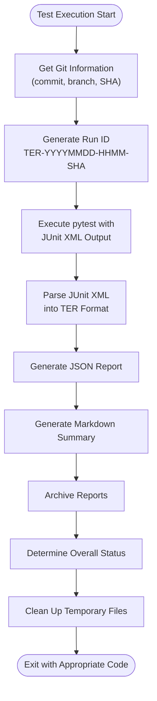
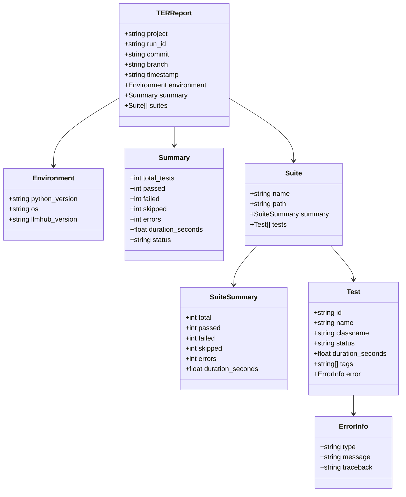
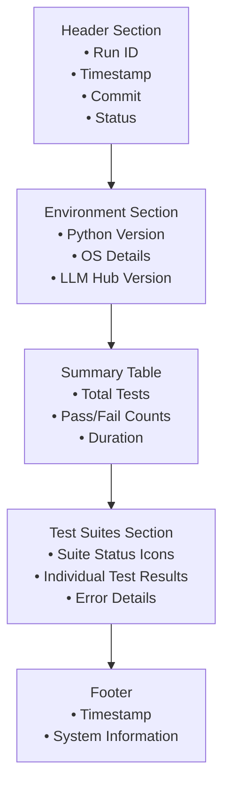
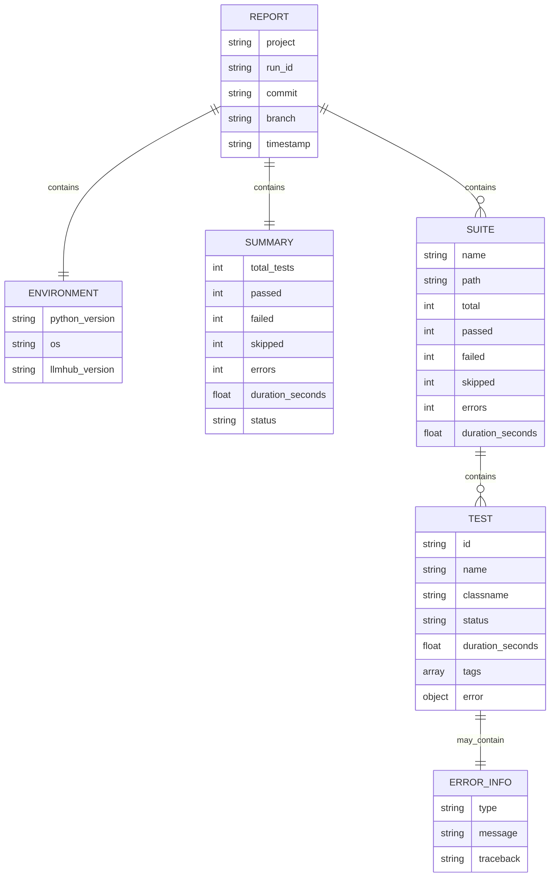
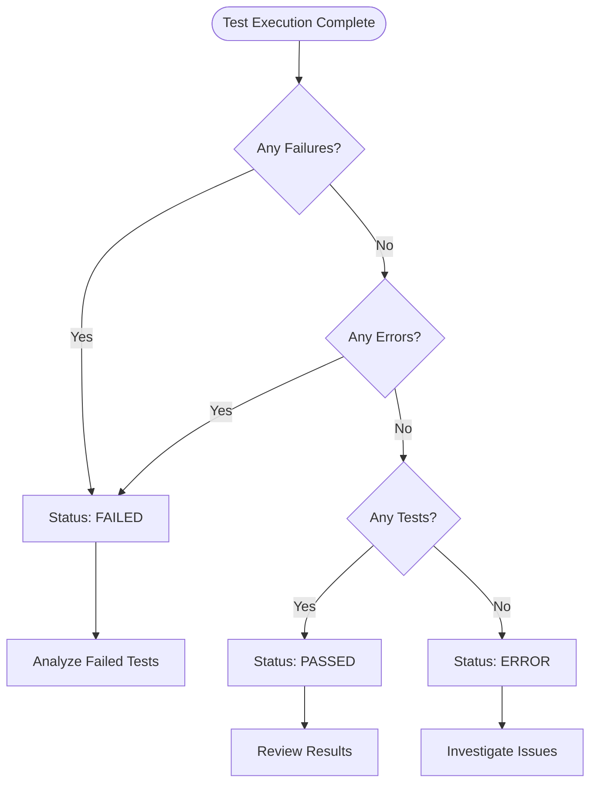
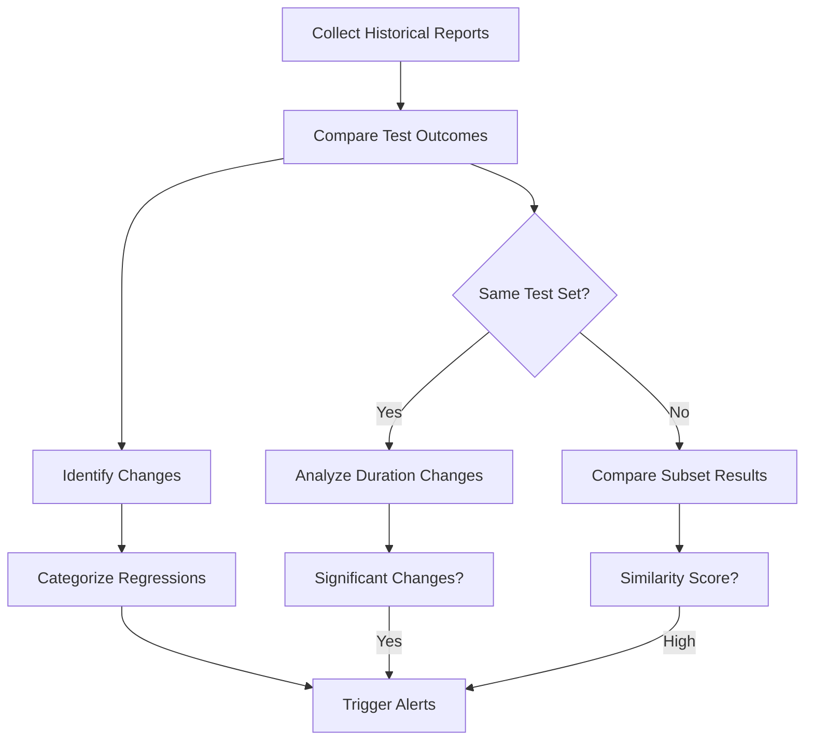

# Test Execution Reports (TER)

<cite>
**Referenced Files in This Document**
- [reports/test-execution/README.md](file://reports/test-execution/README.md)
- [packages/llmhub/src/llmhub/tools/run_tests_with_report.py](file://packages/llmhub/src/llmhub/tools/run_tests_with_report.py)
- [reports/test-execution/TER-20251129-1946-9039552.json](file://reports/test-execution/TER-20251129-1946-9039552.json)
- [reports/test-execution/TER-20251129-1946-9039552.md](file://reports/test-execution/TER-20251129-1946-9039552.md)
- [reports/test-execution/TER-20251129-2001-9039552.json](file://reports/test-execution/TER-20251129-2001-9039552.json)
- [reports/test-execution/TER-20251129-2002-9039552.json](file://reports/test-execution/TER-20251129-2002-9039552.json)
- [Makefile](file://Makefile)
- [pytest.ini](file://pytest.ini)
- [packages/llmhub/src/llmhub/commands/test_cmd.py](file://packages/llmhub/src/llmhub/commands/test_cmd.py)
</cite>

## Table of Contents
1. [Introduction](#introduction)
2. [Report Generation System](#report-generation-system)
3. [File Naming Conventions](#file-naming-conventions)
4. [JSON Report Format](#json-report-format)
5. [Markdown Report Format](#markdown-report-format)
6. [Report Structure Analysis](#report-structure-analysis)
7. [Interpreting Test Results](#interpreting-test-results)
8. [Accessing and Managing Reports](#accessing-and-managing-reports)
9. [Historical Analysis and Regression Tracking](#historical-analysis-and-regression-tracking)
10. [Best Practices](#best-practices)

## Introduction

The Test Execution Report (TER) system in LLM Hub provides comprehensive, structured reporting for automated test runs. This system generates both machine-readable JSON reports and human-friendly Markdown summaries, enabling efficient test result analysis, regression tracking, and continuous integration workflows.

The TER system captures detailed information about test execution, including individual test outcomes, timing metrics, environment details, and error information. It serves as a critical component for quality assurance and development workflow automation.

## Report Generation System

The TER system is built around a dedicated test runner that executes pytest suites and generates comprehensive reports. The primary entry point is the `run_tests_with_report.py` script, which orchestrates the entire process.



**Diagram sources**
- [packages/llmhub/src/llmhub/tools/run_tests_with_report.py](file://packages/llmhub/src/llmhub/tools/run_tests_with_report.py#L309-L395)

**Section sources**
- [packages/llmhub/src/llmhub/tools/run_tests_with_report.py](file://packages/llmhub/src/llmhub/tools/run_tests_with_report.py#L1-L395)

## File Naming Conventions

TER reports follow a strict naming convention that enables easy identification and chronological ordering:

### Format Pattern
```
TER-YYYYMMDD-HHMM-<short_sha>.json
TER-YYYYMMDD-HHMM-<short_sha>.md
```

### Components Breakdown

| Component | Description | Example |
|-----------|-------------|---------|
| `TER` | Test Execution Report identifier | Fixed prefix |
| `YYYYMMDD` | Date of test execution | `20251129` |
| `HHMM` | Time of test execution (24-hour format) | `1946` |
| `<short_sha>` | Git commit short hash | `9039552` |

### Example Filenames
- `TER-20251129-1946-9039552.json`
- `TER-20251129-1946-9039552.md`
- `TER-20251129-2001-9039552.json`
- `TER-20251129-2002-9039552.md`

**Section sources**
- [reports/test-execution/README.md](file://reports/test-execution/README.md#L7-L10)

## JSON Report Format

The JSON format provides a complete, structured representation of test execution results suitable for programmatic analysis and integration with CI/CD systems.

### Schema Definition



**Diagram sources**
- [reports/test-execution/TER-20251129-1946-9039552.json](file://reports/test-execution/TER-20251129-1946-9039552.json#L1-L466)

### Core Fields

| Field | Type | Description | Example |
|-------|------|-------------|---------|
| `project` | string | Project identifier | `"llm-hub"` |
| `run_id` | string | Unique run identifier | `"TER-20251129-1946-9039552"` |
| `commit` | string | Full git commit hash | `"90395524b307467ab053f190076760cb2d821282"` |
| `branch` | string | Git branch name | `"main"` |
| `timestamp` | string | ISO 8601 timestamp | `"2025-11-29T19:46:34.676931"` |

### Environment Information

| Field | Type | Description | Example |
|-------|------|-------------|---------|
| `python_version` | string | Python interpreter version | `"3.11.11"` |
| `os` | string | Operating system details | `"Darwin 25.0.0"` |
| `llmhub_version` | string | LLM Hub package version | `"0.1.0"` |

### Summary Metrics

| Field | Type | Description | Example |
|-------|------|-------------|---------|
| `total_tests` | integer | Total number of tests executed | `45` |
| `passed` | integer | Number of passing tests | `39` |
| `failed` | integer | Number of failed tests | `6` |
| `skipped` | integer | Number of skipped tests | `0` |
| `errors` | integer | Number of test suite errors | `0` |
| `duration_seconds` | float | Total execution time in seconds | `0.897` |
| `status` | string | Overall test status | `"failed"` |

### Status Values

The `status` field indicates the overall outcome of the test run:

- **`passed`**: All tests executed successfully
- **`failed`**: One or more tests failed or had errors
- **`error`**: Test suite encountered critical errors

**Section sources**
- [reports/test-execution/README.md](file://reports/test-execution/README.md#L11-L52)

## Markdown Report Format

The Markdown format provides a human-readable summary optimized for quick review and integration into documentation systems.

### Structure and Organization



**Diagram sources**
- [reports/test-execution/TER-20251129-1946-9039552.md](file://reports/test-execution/TER-20251129-1946-9039552.md#L1-L47)

### Visual Elements

The Markdown reports use consistent formatting for improved readability:

| Element | Format | Purpose |
|---------|--------|---------|
| Headers | `#` level 1-3 | Organize content hierarchy |
| Status Indicators | ✓ ✗ ⊘ ⚠ | Quick visual assessment |
| Tables | Markdown table syntax | Present structured data |
| Code Blocks | Backticks | Display error messages and stack traces |
| Links | `[text](url)` | Reference external resources |

### Status Icon Convention

| Icon | Meaning | Test Status |
|------|---------|-------------|
| ✓ | All tests passed | `passed` |
| ✗ | Some tests failed | `failed` |
| ⊘ | Tests were skipped | `skipped` |
| ⚠ | Test suite errors occurred | `error` |

**Section sources**
- [reports/test-execution/README.md](file://reports/test-execution/README.md#L53-L67)

## Report Structure Analysis

### Complete Report Example

Examining the actual report files reveals the comprehensive nature of the TER system:

#### JSON Report Structure
The JSON reports contain detailed information about each test execution, including individual test results with error information:



**Diagram sources**
- [reports/test-execution/TER-20251129-1946-9039552.json](file://reports/test-execution/TER-20251129-1946-9039552.json#L1-L466)

#### Test Status Variations

The reports capture various test outcomes:

1. **Successful Tests**: `status: "passed"` with `error: null`
2. **Failed Tests**: `status: "failed"` with detailed error information
3. **Errored Tests**: `status: "error"` indicating test setup/cleanup issues
4. **Skipped Tests**: `status: "skipped"` with skip reason

### Error Information Structure

When tests fail, the reports include comprehensive error details:

| Field | Type | Description | Example |
|-------|------|-------------|---------|
| `type` | string | Exception type | `"AssertionError"` |
| `message` | string | Error description | `"click.exceptions.Exit: 1"` |
| `traceback` | string | Stack trace information | Full Python traceback |

**Section sources**
- [reports/test-execution/TER-20251129-1946-9039552.json](file://reports/test-execution/TER-20251129-1946-9039552.json#L35-L45)

## Interpreting Test Results

### Understanding Status Codes

The TER system provides multiple levels of status information for comprehensive result interpretation:

#### Overall Status Interpretation



**Diagram sources**
- [packages/llmhub/src/llmhub/tools/run_tests_with_report.py](file://packages/llmhub/src/llmhub/tools/run_tests_with_report.py#L223-L230)

#### Detailed Status Analysis

| Status | Condition | Action Required |
|--------|-----------|-----------------|
| `passed` | All tests successful | Review results, continue development |
| `failed` | One or more tests failed | Investigate failed test cases |
| `error` | Test suite critical failure | Check environment, dependencies |

### Duration Analysis

Test execution time provides insights into performance characteristics:

- **Fast Tests (< 0.1s)**: Unit tests, simple validations
- **Medium Tests (0.1s - 1s)**: Integration tests, moderate complexity
- **Slow Tests (> 1s)**: Complex scenarios, external dependencies

### Regression Detection

The consistent naming convention enables automatic regression detection:

1. **Compare Across Runs**: Use filename timestamps to track changes
2. **Identify Patterns**: Look for recurring failures in multiple runs
3. **Measure Performance**: Track duration trends over time

**Section sources**
- [reports/test-execution/README.md](file://reports/test-execution/README.md#L61-L67)

## Accessing and Managing Reports

### Report Location and Organization

Reports are stored in the `reports/test-execution/` directory with automatic organization:

```
reports/test-execution/
├── README.md                 # Documentation
├── TER-20251129-1946-9039552.json
├── TER-20251129-1946-9039552.md
├── TER-20251129-2001-9039552.json
├── TER-20251129-2001-9039552.md
└── ...
```

### Command Line Access

The Makefile provides convenient access to report generation:

```bash
# Generate reports for current test run
make test-report

# Alternative direct execution
python -m llmhub.tools.run_tests_with_report
```

### Programmatic Access

Reports can be accessed programmatically for CI/CD integration:

```python
import json
from pathlib import Path

# Load latest report
reports_dir = Path("reports/test-execution")
latest_json = max(reports_dir.glob("*.json"))
with open(latest_json) as f:
    report = json.load(f)
    
# Access summary information
summary = report["summary"]
print(f"Tests: {summary['total_tests']}")
print(f"Status: {summary['status']}")
```

### Report Archiving Strategy

The system automatically manages report storage:

1. **Automatic Generation**: Reports created with each test execution
2. **Naming Consistency**: Predictable filenames for easy scripting
3. **Directory Organization**: Centralized storage in `reports/test-execution/`
4. **Cleanup**: Temporary files removed after processing

**Section sources**
- [Makefile](file://Makefile#L23-L24)
- [packages/llmhub/src/llmhub/tools/run_tests_with_report.py](file://packages/llmhub/src/llmhub/tools/run_tests_with_report.py#L350-L365)

## Historical Analysis and Regression Tracking

### Long-term Trend Analysis

The TER system enables comprehensive historical analysis:

#### Performance Trends
- **Execution Time**: Monitor test suite performance over time
- **Failure Rates**: Track stability improvements
- **Resource Utilization**: Identify bottlenecks

#### Regression Detection Methods



**Diagram sources**
- [reports/test-execution/TER-20251129-1946-9039552.json](file://reports/test-execution/TER-20251129-1946-9039552.json#L1-L466)

### Automated Analysis Scripts

Example analysis approaches:

1. **Daily Comparison**: Compare current run with previous day's results
2. **Weekly Trends**: Analyze weekly performance patterns
3. **Version Correlation**: Link test results with code changes
4. **Environment Impact**: Track results across different environments

### Integration with CI/CD

The structured format enables seamless CI/CD integration:

- **Jenkins Pipeline**: Parse reports for build status
- **GitHub Actions**: Upload reports as artifacts
- **Azure DevOps**: Integrate with test result publishing
- **Custom Dashboards**: Build monitoring interfaces

### Report Retention Policies

Implement retention strategies for long-term analysis:

1. **Short-term Storage**: Recent reports for immediate analysis
2. **Long-term Archival**: Historical data preservation
3. **Compression**: Efficient storage of older reports
4. **Indexing**: Fast retrieval of specific report periods

**Section sources**
- [reports/test-execution/README.md](file://reports/test-execution/README.md#L1-L10)

## Best Practices

### Report Generation Workflow

1. **Consistent Execution**: Always use the standardized report generator
2. **Environment Control**: Ensure consistent test environments
3. **Timing Considerations**: Account for system load during report generation
4. **Error Handling**: Implement proper cleanup for failed executions

### Analysis Guidelines

1. **Baseline Establishment**: Define acceptable performance baselines
2. **Threshold Setting**: Establish alert thresholds for regressions
3. **Pattern Recognition**: Look for consistent failure patterns
4. **Root Cause Analysis**: Investigate significant changes promptly

### Integration Recommendations

1. **Automated Parsing**: Develop scripts for automated report analysis
2. **Visualization**: Create dashboards for trend monitoring
3. **Alert Systems**: Configure notifications for significant changes
4. **Documentation**: Maintain analysis procedures and findings

### Maintenance Procedures

1. **Report Cleanup**: Regular cleanup of old reports
2. **Format Validation**: Verify report schema compliance
3. **Backup Strategies**: Protect critical historical data
4. **Performance Monitoring**: Track report generation overhead

The TER system provides a robust foundation for comprehensive test result analysis, enabling teams to maintain high-quality standards while efficiently managing regression tracking and performance monitoring.