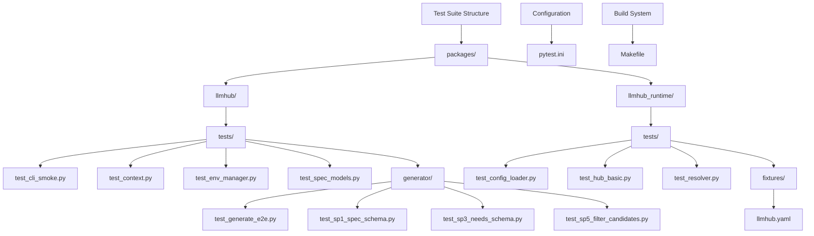
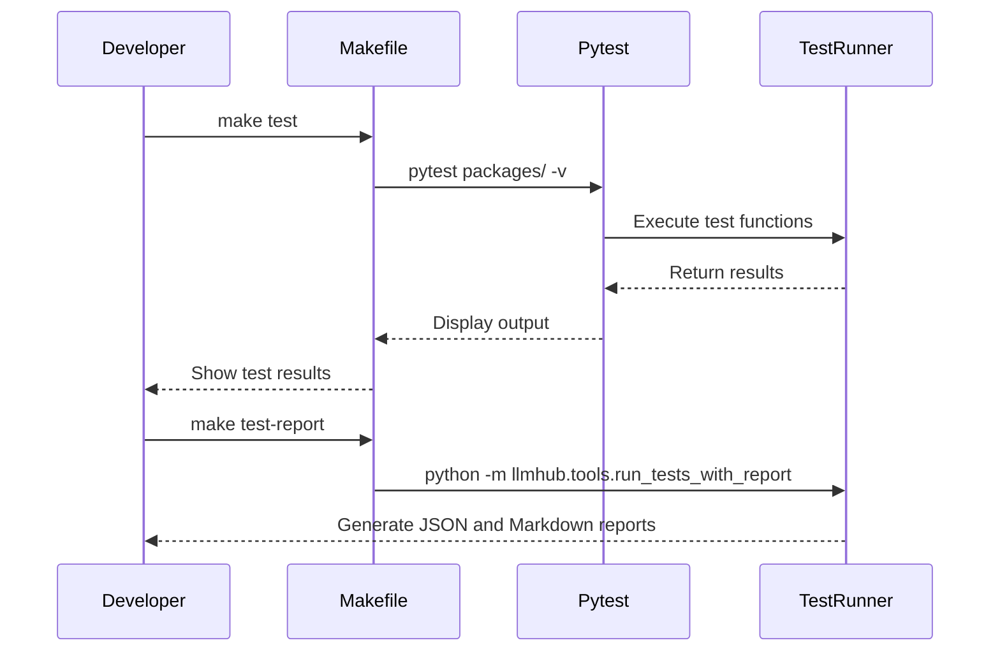
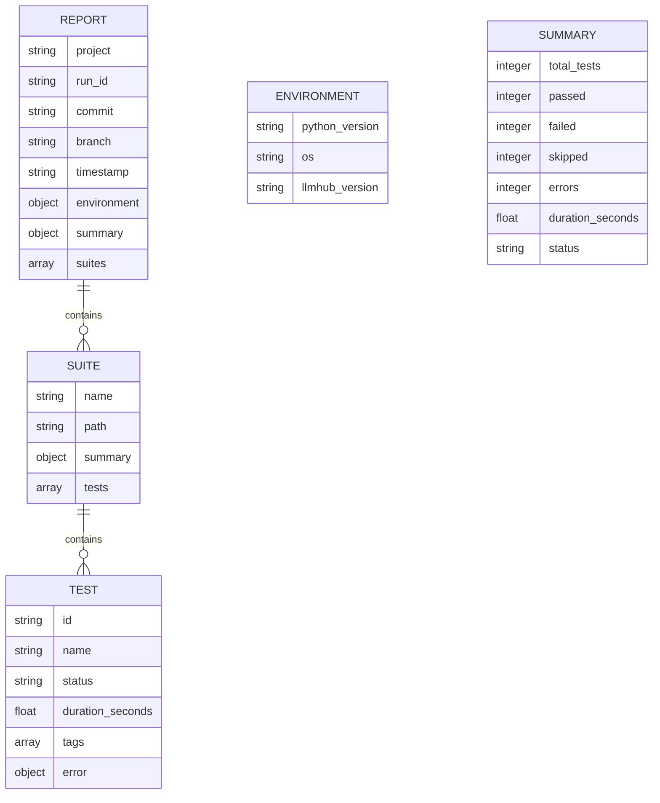
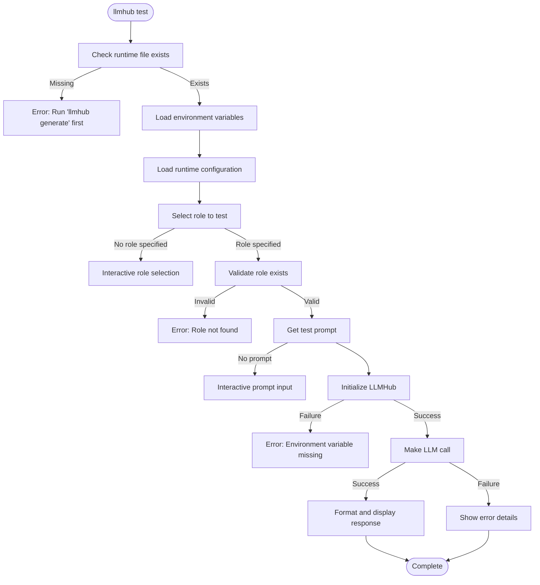
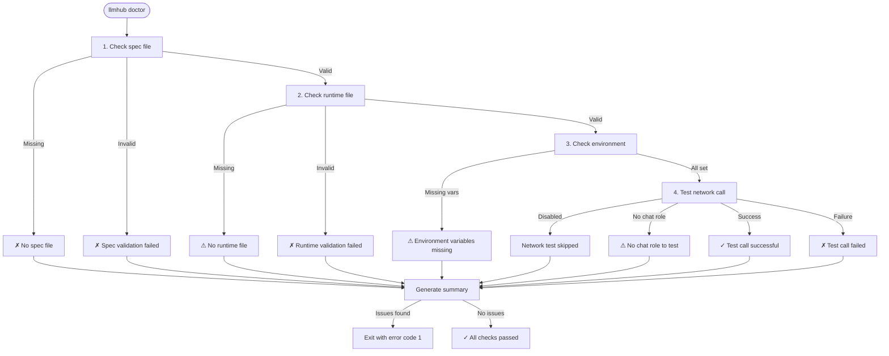
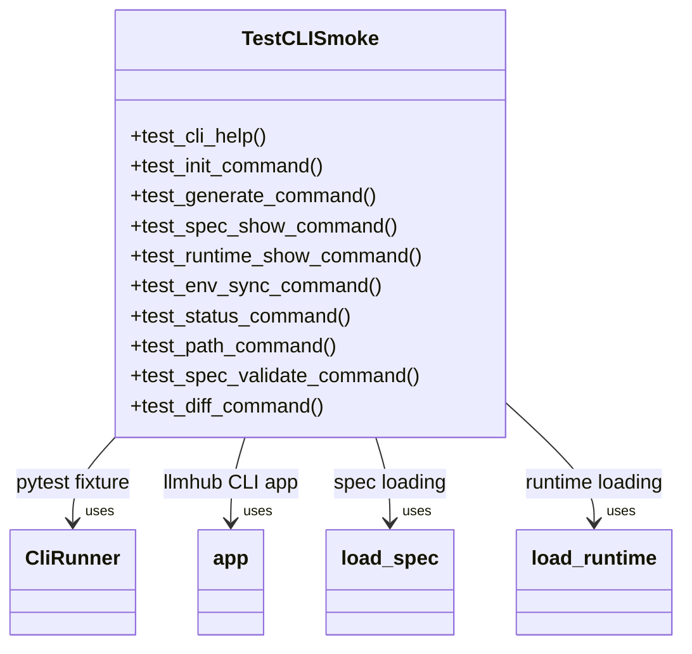
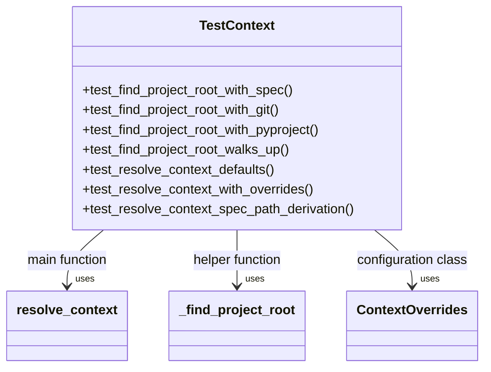
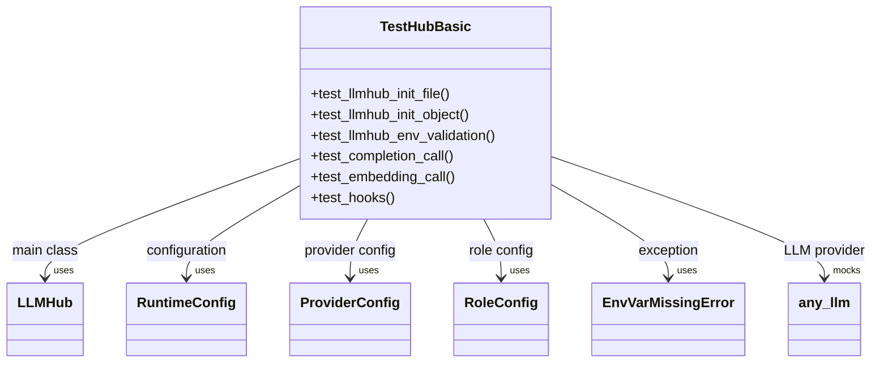

# Testing and Validation

<cite>
**Referenced Files in This Document**   
- [test_cli_smoke.py](file://packages/llmhub/tests/test_cli_smoke.py)
- [test_context.py](file://packages/llmhub/tests/test_context.py)
- [test_hub_basic.py](file://packages/llmhub_runtime/tests/test_hub_basic.py)
- [test_env_manager.py](file://packages/llmhub/tests/test_env_manager.py)
- [test_spec_models.py](file://packages/llmhub/tests/test_spec_models.py)
- [run_tests_with_report.py](file://packages/llmhub/src/llmhub/tools/run_tests_with_report.py)
- [test_cmd.py](file://packages/llmhub/src/llmhub/commands/test_cmd.py)
- [cli.py](file://packages/llmhub/src/llmhub/cli.py)
- [pytest.ini](file://pytest.ini)
- [Makefile](file://Makefile)
- [README.md](file://reports/test-execution/README.md)
</cite>

## Table of Contents
1. [Introduction](#introduction)
2. [Test Suite Structure](#test-suite-structure)
3. [Running Tests](#running-tests)
4. [Test Execution Report System](#test-execution-report-system)
5. [Interactive Testing with llmhub test](#interactive-testing-with-llmhub-test)
6. [Environment Diagnostics with llmhub doctor](#environment-diagnostics-with-llmhub-doctor)
7. [Test Case Examples](#test-case-examples)
8. [Best Practices for Writing Tests](#best-practices-for-writing-tests)
9. [Conclusion](#conclusion)

## Introduction
The LLM Hub testing framework provides a comprehensive validation system for both the runtime and CLI components. This documentation details the test infrastructure, execution methods, reporting mechanisms, and interactive diagnostic tools that ensure the reliability and correctness of the LLM Hub system. The test suite is built on pytest and includes both unit and integration tests that validate core functionality across the application.

## Test Suite Structure
The LLM Hub test suite is organized across two main packages: `llmhub` and `llmhub_runtime`. Each package contains a dedicated `tests` directory with specialized test files targeting specific components.



**Diagram sources**
- [test_cli_smoke.py](file://packages/llmhub/tests/test_cli_smoke.py)
- [test_context.py](file://packages/llmhub/tests/test_context.py)
- [test_hub_basic.py](file://packages/llmhub_runtime/tests/test_hub_basic.py)
- [pytest.ini](file://pytest.ini)
- [Makefile](file://Makefile)

**Section sources**
- [test_cli_smoke.py](file://packages/llmhub/tests/test_cli_smoke.py#L1-L165)
- [test_context.py](file://packages/llmhub/tests/test_context.py#L1-L83)
- [test_hub_basic.py](file://packages/llmhub_runtime/tests/test_hub_basic.py#L1-L79)

## Running Tests
Tests can be executed through multiple methods, providing flexibility for different development workflows.

### Direct pytest Execution
The test suite can be run directly using pytest. The `pytest.ini` configuration file defines the test discovery paths and patterns:

```ini
[pytest]
testpaths = packages/llmhub/tests packages/llmhub_runtime/tests
python_files = test_*.py
python_classes = Test*
python_functions = test_*
norecursedirs = .git .pytest_cache __pycache__ *.egg-info build dist src
```

To run all tests:
```bash
pytest packages/ -v
```

### Make Command Execution
The Makefile provides a convenient wrapper for test execution:

```makefile
test:
	pytest packages/ -v

test-report:
	python -m llmhub.tools.run_tests_with_report
```

The `make test` command runs pytest with verbose output, while `make test-report` executes the test suite with enhanced reporting capabilities.



**Diagram sources**
- [pytest.ini](file://pytest.ini#L1-L10)
- [Makefile](file://Makefile#L20-L25)

**Section sources**
- [pytest.ini](file://pytest.ini#L1-L10)
- [Makefile](file://Makefile#L20-L25)

## Test Execution Report System
The Test Execution Report (TER) system generates comprehensive reports in both JSON and Markdown formats, stored in the `reports/test-execution/` directory.

### Report Generation
The `make test-report` command invokes the `run_tests_with_report.py` tool, which executes the test suite and generates structured reports:

```bash
python -m llmhub.tools.run_tests_with_report
```

### Report Structure
Each test run produces two files with a consistent naming pattern:
- `TER-YYYYMMDD-HHMM-<short_sha>.json` - Structured JSON report
- `TER-YYYYMMDD-HHMM-<short_sha>.md` - Human-readable Markdown summary

The JSON report follows a standardized schema with the following top-level structure:



**Diagram sources**
- [README.md](file://reports/test-execution/README.md#L1-L67)

**Section sources**
- [README.md](file://reports/test-execution/README.md#L1-L67)

### Report Interpretation
The report status can be one of three values:
- **passed**: All tests passed successfully
- **failed**: One or more tests failed
- **error**: Test suite encountered an execution error

Key interpretation guidelines:
- Check the `summary.status` field first to determine overall outcome
- Examine `summary.duration_seconds` for performance trends
- Review failed test details in the `suites` array, specifically the `error` field
- Use the `run_id` to correlate reports with specific code changes

## Interactive Testing with llmhub test
The `llmhub test` command provides an interactive way to test role configurations with actual LLM calls.

### Command Usage
```bash
llmhub test --role <role_name> --prompt "<test prompt>" --json
```

Key options:
- `--role`: Specify which role to test (optional, interactive selection if omitted)
- `--prompt`: Provide a test prompt (optional, prompted if omitted)
- `--env-file`: Specify alternative .env file path
- `--json`: Output raw JSON response instead of formatted output

### Test Flow


**Diagram sources**
- [test_cmd.py](file://packages/llmhub/src/llmhub/commands/test_cmd.py#L18-L123)

**Section sources**
- [test_cmd.py](file://packages/llmhub/src/llmhub/commands/test_cmd.py#L18-L123)
- [cli.py](file://packages/llmhub/src/llmhub/cli.py#L38)

## Environment Diagnostics with llmhub doctor
The `llmhub doctor` command performs a comprehensive health check of the LLM Hub environment.

### Diagnostic Checks
The doctor command performs four main checks:

1. **Spec validation**: Verifies the spec file exists and is valid
2. **Runtime validation**: Checks the runtime file exists and is valid
3. **Environment variables**: Validates required environment variables are set
4. **Network connectivity**: Tests actual LLM API calls (optional)

### Command Usage
```bash
llmhub doctor --no-network
```

The `--no-network` flag skips the network test calls, useful for offline environments.

### Diagnostic Flow


**Diagram sources**
- [test_cmd.py](file://packages/llmhub/src/llmhub/commands/test_cmd.py#L125-L232)

**Section sources**
- [test_cmd.py](file://packages/llmhub/src/llmhub/commands/test_cmd.py#L125-L232)
- [cli.py](file://packages/llmhub/src/llmhub/cli.py#L39)

## Test Case Examples
The test suite includes various types of test cases that demonstrate different testing patterns.

### CLI Smoke Tests
The `test_cli_smoke.py` file contains end-to-end workflow tests for the CLI:



These tests validate the basic workflow: init → generate → env sync, ensuring the core CLI commands function correctly.

**Diagram sources**
- [test_cli_smoke.py](file://packages/llmhub/tests/test_cli_smoke.py#L1-L165)

**Section sources**
- [test_cli_smoke.py](file://packages/llmhub/tests/test_cli_smoke.py#L1-L165)

### Context Resolution Tests
The `test_context.py` file validates the context resolution system:



These tests ensure the system can correctly identify the project root and resolve file paths across different scenarios.

**Diagram sources**
- [test_context.py](file://packages/llmhub/tests/test_context.py#L1-L83)

**Section sources**
- [test_context.py](file://packages/llmhub/tests/test_context.py#L1-L83)

### Runtime Hub Tests
The `test_hub_basic.py` file contains tests for the LLMHub runtime:



These tests validate initialization, environment validation, and LLM call functionality.

**Diagram sources**
- [test_hub_basic.py](file://packages/llmhub_runtime/tests/test_hub_basic.py#L1-L79)

**Section sources**
- [test_hub_basic.py](file://packages/llmhub_runtime/tests/test_hub_basic.py#L1-L79)

## Best Practices for Writing Tests
When writing new tests for the LLM Hub system, follow these best practices to ensure maintainable and effective test coverage.

### Test Organization
- Place unit tests in the `tests/` directory corresponding to the source package
- Use descriptive test function names starting with `test_`
- Group related tests in classes when appropriate
- Use pytest fixtures for shared setup/teardown logic

### Test Patterns
- **Unit tests**: Focus on isolated functions and classes
- **Integration tests**: Test interactions between components
- **End-to-end tests**: Validate complete workflows
- **Parameterized tests**: Use `@pytest.mark.parametrize` for multiple test cases

### Mocking Strategy
- Use `unittest.mock.patch` for external dependencies
- Mock LLM providers to avoid actual API calls in unit tests
- Use fixtures for consistent mock setup

### Test Coverage
- Aim for high coverage of critical paths
- Test both success and error conditions
- Include edge cases and boundary conditions
- Validate input validation and error handling

### Performance Considerations
- Mark slow tests with `@pytest.mark.slow`
- Use `tmp_path` fixture for temporary file operations
- Avoid actual network calls in unit tests
- Use parameterized tests to reduce duplication

## Conclusion
The LLM Hub testing and validation system provides a robust framework for ensuring the reliability and correctness of both the runtime and CLI components. The pytest-based test suite covers unit, integration, and end-to-end testing scenarios, with comprehensive reporting through the Test Execution Report system. The interactive `llmhub test` and `llmhub doctor` commands provide valuable tools for developers to validate configurations and diagnose issues. By following the established patterns and best practices, new tests can be added to maintain high code quality and coverage as the system evolves.