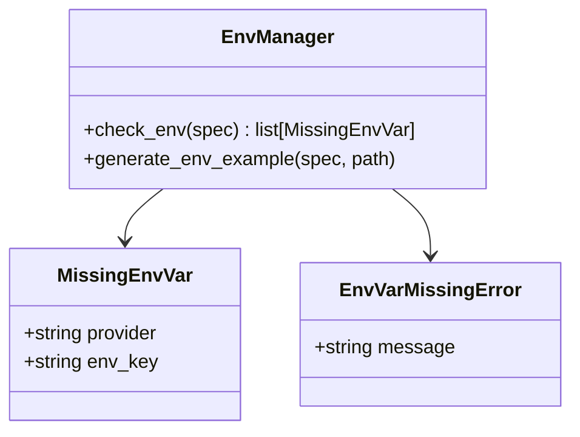
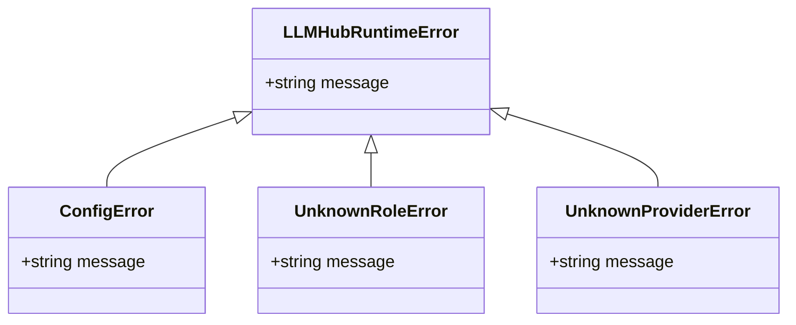
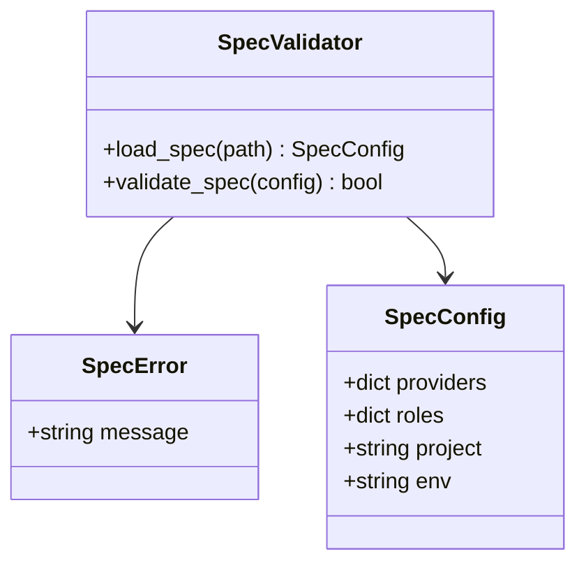
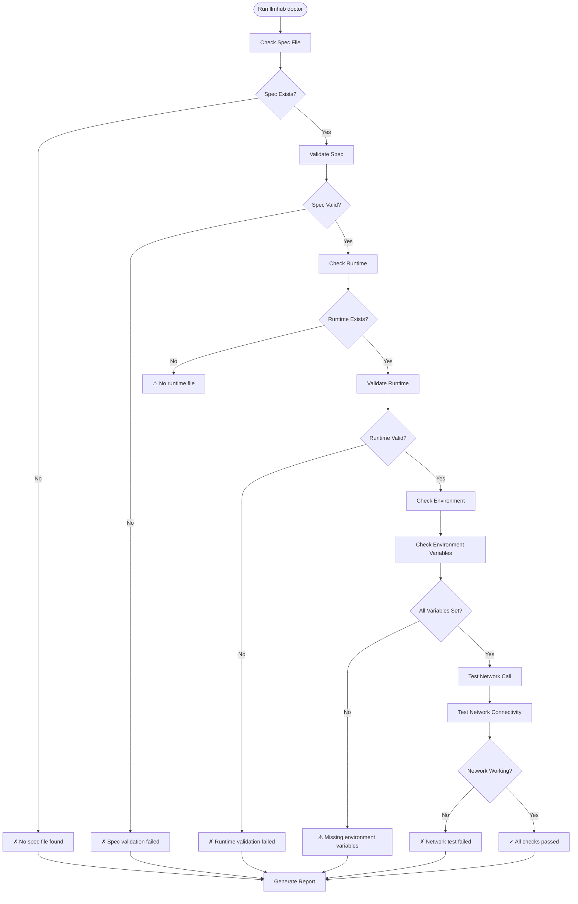
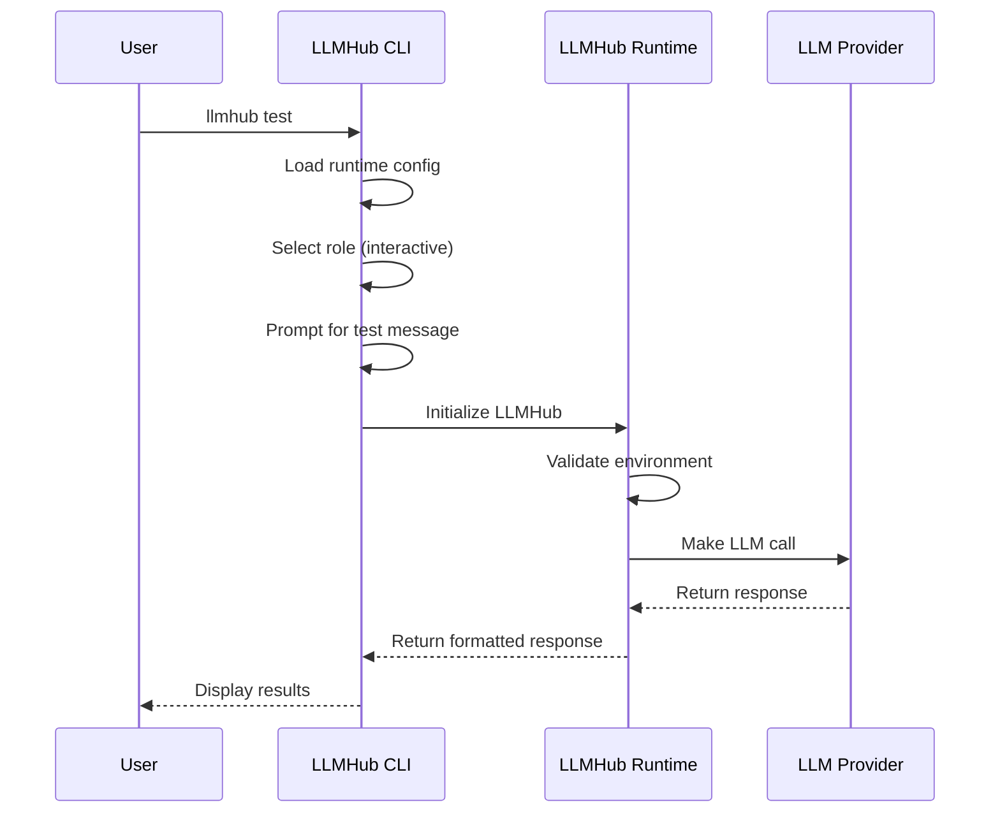

# Troubleshooting Guide

<cite>
**Referenced Files in This Document**
- [ux.py](file://packages/llmhub/src/llmhub/ux.py)
- [errors.py](file://packages/llmhub_runtime/src/llmhub_runtime/errors.py)
- [cli.py](file://packages/llmhub/src/llmhub/cli.py)
- [env_manager.py](file://packages/llmhub/src/llmhub/env_manager.py)
- [test_cmd.py](file://packages/llmhub/src/llmhub/commands/test_cmd.py)
- [catalog_cmd.py](file://packages/llmhub/src/llmhub/commands/catalog_cmd.py)
- [runtime_cmd.py](file://packages/llmhub/src/llmhub/commands/runtime_cmd.py)
- [spec_cmd.py](file://packages/llmhub/src/llmhub/commands/spec_cmd.py)
- [setup_cmd.py](file://packages/llmhub/src/llmhub/commands/setup_cmd.py)
- [config_loader.py](file://packages/llmhub_runtime/src/llmhub_runtime/config_loader.py)
- [spec_models.py](file://packages/llmhub/src/llmhub/spec_models.py)
</cite>

## Table of Contents
1. [Introduction](#introduction)
2. [Common Error Types](#common-error-types)
3. [Diagnostic Tools](#diagnostic-tools)
4. [Environment Variable Issues](#environment-variable-issues)
5. [Catalog and Model Selection Problems](#catalog-and-model-selection-problems)
6. [Configuration Validation Issues](#configuration-validation-issues)
7. [Runtime and Generation Errors](#runtime-and-generation-errors)
8. [Testing and Debugging Procedures](#testing-and-debugging-procedures)
9. [Step-by-Step Troubleshooting Guide](#step-by-step-troubleshooting-guide)
10. [Prevention and Best Practices](#prevention-and-best-practices)

## Introduction

LLM Hub is a sophisticated system for managing Large Language Model configurations through declarative specifications. When issues arise, they typically fall into several categories: environment configuration problems, catalog refresh failures, model selection errors, or runtime validation issues. This guide provides comprehensive troubleshooting procedures to help you diagnose and resolve common problems efficiently.

The system consists of two main components:
- **CLI Tool**: Manages specifications and runtime configurations
- **Runtime Library**: Handles actual LLM calls with resolved configurations

## Common Error Types

### Environment Variable Errors

The most frequent issues involve missing or incorrectly configured environment variables.



**Diagram sources**
- [env_manager.py](file://packages/llmhub/src/llmhub/env_manager.py#L9-L13)
- [errors.py](file://packages/llmhub_runtime/src/llmhub_runtime/errors.py#L17-L19)

### Runtime Configuration Errors

Errors that occur during runtime execution or configuration loading.



**Diagram sources**
- [errors.py](file://packages/llmhub_runtime/src/llmhub_runtime/errors.py#L1-L19)

### Spec Validation Errors

Issues with specification file format or content.



**Diagram sources**
- [spec_models.py](file://packages/llmhub/src/llmhub/spec_models.py#L68-L90)

## Diagnostic Tools

### `llmhub doctor` - Comprehensive Health Check

The `doctor` command provides a systematic approach to diagnosing LLM Hub issues.



**Diagram sources**
- [test_cmd.py](file://packages/llmhub/src/llmhub/commands/test_cmd.py#L125-L232)

### `--explain` Flag for Detailed Information

Use the `--explain` flag with generation commands to get detailed reasoning for model selections:

```bash
# Generate runtime with explanations
llmhub generate --explain

# Test with detailed output
llmhub test --explain
```

**Section sources**
- [test_cmd.py](file://packages/llmhub/src/llmhub/commands/test_cmd.py#L125-L232)
- [runtime_cmd.py](file://packages/llmhub/src/llmhub/commands/runtime_cmd.py#L17-L18)

## Environment Variable Issues

### Problem: Missing API Keys

**Symptoms:**
- `EnvVarMissingError` exceptions
- `MissingEnvVar` warnings in CLI output
- Runtime failures when making LLM calls

**Diagnosis Steps:**

1. **Check Current Environment:**
```bash
llmhub env check
```

2. **Verify .env File:**
```bash
cat .env
```

3. **Check Environment Variables:**
```bash
env | grep -E "(API_KEY|OPENAI|ANTHROPIC)"
```

**Solutions:**

1. **Create .env File:**
```bash
cp .env.example .env
# Edit .env and add your API keys
```

2. **Set Environment Variables:**
```bash
export OPENAI_API_KEY="sk-..."
export ANTHROPIC_API_KEY="sk-ant-..."
```

3. **Use Provider-Specific Environment Variables:**
```bash
export YOUR_PROVIDER_API_KEY="your-key-value"
```

**Prevention:**
- Always maintain a `.env.example` file
- Never commit `.env` files to version control
- Use different API keys for different environments

**Section sources**
- [env_manager.py](file://packages/llmhub/src/llmhub/env_manager.py#L46-L71)
- [test_cmd.py](file://packages/llmhub/src/llmhub/commands/test_cmd.py#L166-L182)

## Catalog and Model Selection Problems

### Problem: Catalog Refresh Failures

**Symptoms:**
- `Failed to build catalog` errors
- Empty model lists in `llmhub catalog show`
- Timeout or connection errors

**Diagnosis:**

1. **Check Network Connectivity:**
```bash
curl https://models.dev/api.json
curl https://raw.githubusercontent.com/lmarena/arena-catalog/main/data/arena-catalog.json
```

2. **Force Catalog Refresh:**
```bash
llmhub catalog refresh --ttl 0
```

3. **Check Cache Location:**
```bash
ls ~/.config/llmhub/catalog.json
```

**Solutions:**

1. **Clear Cache and Retry:**
```bash
rm ~/.config/llmhub/catalog.json
llmhub catalog refresh
```

2. **Use Offline Mode:**
```bash
llmhub catalog show --provider openai  # Use cached data
```

3. **Manual Catalog Override:**
```python
# For testing, you can override catalog data
llmhub generate --catalog-override "[{...}]"
```

### Problem: No Models Available

**Symptoms:**
- Empty catalog after refresh
- `No models found in catalog` messages
- Model selection failures during generation

**Diagnosis Steps:**

1. **Check Provider API Keys:**
```bash
llmhub env check
```

2. **Verify Provider Configuration:**
```bash
llmhub spec show
```

3. **Test Provider Access:**
```bash
# Check if any-llm can discover models
python -c "from any_llm import AnyLLM; print(AnyLLM().list_models())"
```

**Solutions:**

1. **Ensure API Keys Are Correct:**
```bash
# Verify API key works
curl -H "Authorization: Bearer $OPENAI_API_KEY" \
     https://api.openai.com/v1/models
```

2. **Check Provider Status:**
- Verify providers are enabled in spec
- Check for rate limiting or account restrictions
- Ensure API quotas are available

3. **Fallback Provider Configuration:**
```yaml
providers:
  openai:
    enabled: true
    env_key: OPENAI_API_KEY
  # Add backup providers
  anthropic:
    enabled: false  # Temporarily disable
```

**Section sources**
- [catalog_cmd.py](file://packages/llmhub/src/llmhub/commands/catalog_cmd.py#L16-L48)
- [loader.py](file://packages/llmhub/src/llmhub/generator/sp4_catalog_view/loader.py#L12-L41)

## Configuration Validation Issues

### Problem: Spec File Validation Errors

**Symptoms:**
- `Spec validation failed` errors
- YAML parsing errors
- Invalid field types or values

**Common Validation Errors:**

| Error Type | Description | Solution |
|------------|-------------|----------|
| `YAML parsing error` | Malformed YAML syntax | Fix YAML indentation and structure |
| `Field required` | Missing required fields | Add mandatory fields to spec |
| `Invalid enum value` | Wrong enum values | Use allowed values (low/medium/high) |
| `Type mismatch` | Wrong data types | Ensure correct types (strings, numbers, booleans) |

**Diagnosis:**

1. **Validate Spec File:**
```bash
llmhub spec validate
```

2. **Check YAML Syntax:**
```bash
# Use online YAML validators or linters
yamllint llmhub.spec.yaml
```

3. **Review Error Messages:**
```bash
# Look for specific field names in error messages
llmhub spec validate 2>&1 | grep -E "(field|type|enum)"
```

**Solutions:**

1. **Fix YAML Structure:**
```yaml
# Correct indentation
roles:
  llm.inference:
    kind: chat
    description: Main inference model
    preferences:
      cost: medium
      quality: high
```

2. **Validate Field Values:**
```yaml
# Use correct enum values
preferences:
  cost: low      # Not "cheap"
  quality: high  # Not "maximum"
```

3. **Check Provider Configuration:**
```yaml
providers:
  openai:
    enabled: true  # Boolean, not string
    env_key: OPENAI_API_KEY
```

### Problem: Runtime Configuration Errors

**Symptoms:**
- `Runtime validation failed` errors
- Invalid role configurations
- Provider mismatches

**Diagnosis:**

1. **Load Runtime Config:**
```bash
llmhub runtime show
```

2. **Compare with Spec:**
```bash
llmhub runtime diff
```

3. **Check Role Definitions:**
```bash
llmhub roles
```

**Solutions:**

1. **Regenerate Runtime:**
```bash
llmhub generate --force
```

2. **Fix Role Specifications:**
```yaml
# Ensure role definitions are complete
llm.inference:
  kind: chat
  description: Main reasoning model
  preferences:
    cost: medium
    quality: high
    providers: [openai, anthropic]
```

3. **Validate Provider Configuration:**
```yaml
# Ensure providers are properly configured
providers:
  openai:
    env_key: OPENAI_API_KEY
```

**Section sources**
- [spec_cmd.py](file://packages/llmhub/src/llmhub/commands/spec_cmd.py#L36-L53)
- [runtime_cmd.py](file://packages/llmhub/src/llmhub/commands/runtime_cmd.py#L78-L96)
- [config_loader.py](file://packages/llmhub_runtime/src/llmhub_runtime/config_loader.py#L6-L42)

## Runtime and Generation Errors

### Problem: Unknown Role Errors

**Symptoms:**
- `UnknownRoleError` exceptions
- `Role not found in runtime` messages
- Runtime calls failing with role not recognized

**Diagnosis:**

1. **List Available Roles:**
```bash
llmhub roles
llmhub runtime show
```

2. **Check Role Names:**
```bash
# Verify exact role names
llmhub roles | grep -i "inference"
```

3. **Validate Role Usage:**
```python
# Check role names in code
hub.completion(role="llm.inference", messages=...)
```

**Solutions:**

1. **Add Missing Roles:**
```bash
llmhub add-role llm.new-role
```

2. **Edit Existing Roles:**
```bash
llmhub edit-role llm.inference
```

3. **Remove Non-existent Roles:**
```bash
llmhub rm-role llm.old-role
```

4. **Regenerate Runtime:**
```bash
llmhub generate --force
```

### Problem: Provider Configuration Issues

**Symptoms:**
- `UnknownProviderError` exceptions
- Provider not found in runtime
- Model selection failures

**Diagnosis:**

1. **Check Provider Configuration:**
```bash
llmhub spec show
```

2. **Verify Provider Availability:**
```bash
llmhub catalog show --provider openai
```

3. **Test Provider Access:**
```bash
# Check if provider is accessible
python -c "from any_llm import AnyLLM; print(AnyLLM().list_models('openai'))"
```

**Solutions:**

1. **Enable Disabled Providers:**
```yaml
providers:
  openai:
    enabled: true  # Ensure enabled
    env_key: OPENAI_API_KEY
```

2. **Add New Providers:**
```bash
# Interactive setup adds new providers
llmhub setup
```

3. **Update Provider Configuration:**
```yaml
# Correct provider configuration
providers:
  openai:
    enabled: true
    env_key: OPENAI_API_KEY
  anthropic:
    enabled: true
    env_key: ANTHROPIC_API_KEY
```

**Section sources**
- [errors.py](file://packages/llmhub_runtime/src/llmhub_runtime/errors.py#L9-L15)
- [runtime_cmd.py](file://packages/llmhub/src/llmhub/commands/runtime_cmd.py#L78-L96)

## Testing and Debugging Procedures

### Interactive Testing

Use the `llmhub test` command for comprehensive testing:



**Diagram sources**
- [test_cmd.py](file://packages/llmhub/src/llmhub/commands/test_cmd.py#L18-L118)

### Testing with Specific Parameters

```bash
# Test specific role with custom prompt
llmhub test --role llm.inference --prompt "Hello, how are you?"

# Output raw JSON response for debugging
llmhub test --role llm.inference --json

# Test with custom .env file
llmhub test --env-file .env.production
```

### Dry Run Generation

```bash
# Preview what would be generated without changing files
llmhub generate --dry-run

# Include explanations for model selections
llmhub generate --dry-run --explain
```

### Network Testing

```bash
# Run health check without network calls
llmhub doctor --no-network

# Test specific provider connectivity
python -c "
from any_llm import AnyLLM
client = AnyLLM()
print(client.list_models('openai'))
"
```

**Section sources**
- [test_cmd.py](file://packages/llmhub/src/llmhub/commands/test_cmd.py#L18-L118)

## Step-by-Step Troubleshooting Guide

### Step 1: Initial Diagnosis

**Command:** `llmhub doctor`

**Purpose:** Comprehensive health check covering all system components.

**Expected Outcome:** All green checks indicate a healthy system.

**Action Plan:**
- If issues appear, address them in order of severity
- Start with critical issues (missing files, validation errors)
- Proceed to warnings (missing environment variables)

### Step 2: Environment Verification

**Command:** `llmhub env check`

**Purpose:** Verify all required environment variables are set.

**Common Issues:**
- Missing API keys
- Incorrect environment variable names
- Unset variables in current shell session

**Resolution:**
1. Check `.env` file existence and content
2. Verify environment variable export
3. Use `llmhub env sync` to regenerate examples

### Step 3: Specification Validation

**Command:** `llmhub spec validate`

**Purpose:** Validate the structure and content of the spec file.

**Common Problems:**
- YAML syntax errors
- Missing required fields
- Invalid enum values
- Type mismatches

**Resolution:**
1. Fix YAML syntax issues
2. Add missing required fields
3. Use correct enum values (low/medium/high)
4. Ensure proper data types

### Step 4: Runtime Generation

**Command:** `llmhub generate --dry-run --explain`

**Purpose:** Preview model selections and identify potential issues.

**Expected Outcome:**
- Clear explanations for model choices
- No warnings or errors in preview
- Expected providers and models selected

**Resolution:**
- Review explanations for unexpected selections
- Adjust spec preferences if needed
- Regenerate with `--force` if satisfied with preview

### Step 5: Testing

**Command:** `llmhub test`

**Purpose:** Verify the system works end-to-end.

**Expected Outcome:**
- Successful LLM calls
- Reasonable response quality
- No errors or warnings

**Resolution:**
- Test specific roles individually
- Use `--json` flag for detailed debugging
- Check network connectivity if calls fail

### Step 6: Runtime Comparison

**Command:** `llmhub runtime diff`

**Purpose:** Compare spec and runtime configurations.

**Expected Outcome:**
- Minimal differences indicating successful generation
- Clear understanding of changes made

**Resolution:**
- Address discrepancies between spec and runtime
- Regenerate if significant differences exist
- Review role configurations

## Prevention and Best Practices

### Configuration Management

1. **Version Control Best Practices:**
```bash
# Track spec files
git add llmhub.spec.yaml
git add .env.example

# Exclude sensitive files
echo ".env" >> .gitignore
```

2. **Environment Separation:**
```bash
# Use different API keys for environments
export OPENAI_API_KEY_DEV="sk-dev-..."
export OPENAI_API_KEY_PROD="sk-prod-..."

# Use environment-specific configs
llmhub generate --dry-run > llmhub.${ENV}.yaml
```

### Monitoring and Maintenance

1. **Regular Validation:**
```bash
# Add to pre-commit hooks
llmhub spec validate
llmhub env check --env-file .env.example
```

2. **Periodic Health Checks:**
```bash
# Daily/weekly monitoring
llmhub doctor --no-network > health-check.log
```

3. **Catalog Updates:**
```bash
# Regular catalog refresh
llmhub catalog refresh --ttl 24
```

### Development Workflow

1. **Iterative Development:**
```bash
# 1. Add new role to spec
llmhub add-role llm.new-feature

# 2. Regenerate and preview
llmhub generate --dry-run --explain

# 3. Test functionality
llmhub test --role llm.new-feature

# 4. Finalize with generation
llmhub generate --force
```

2. **Provider Migration:**
```bash
# 1. Update spec preferences
llmhub edit-role llm.inference
# Change providers list

# 2. Regenerate with explanations
llmhub generate --explain

# 3. Test migration impact
llmhub test --role llm.inference
```

### Error Handling Patterns

1. **Graceful Degradation:**
```python
try:
    hub = LLMHub(config_path="llmhub.yaml", strict_env=True)
except EnvVarMissingError:
    # Fall back to heuristic mode
    hub = LLMHub(config_path="llmhub.yaml", strict_env=False)
```

2. **Retry Logic:**
```python
import time
from llmhub_runtime.errors import LLMHubRuntimeError

def safe_completion(hub, role, messages, max_retries=3):
    for attempt in range(max_retries):
        try:
            return hub.completion(role, messages)
        except LLMHubRuntimeError as e:
            if attempt == max_retries - 1:
                raise
            time.sleep(2 ** attempt)  # Exponential backoff
```

This comprehensive troubleshooting guide provides systematic approaches to diagnosing and resolving common LLM Hub issues. By following these procedures and maintaining good configuration practices, you can ensure reliable operation of your LLM Hub system.